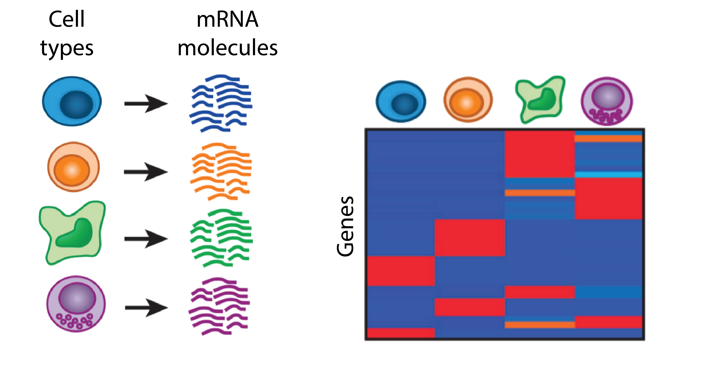
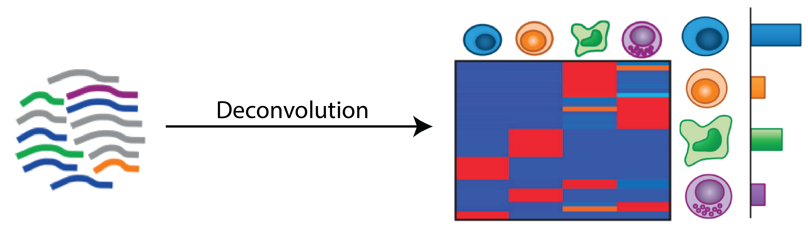
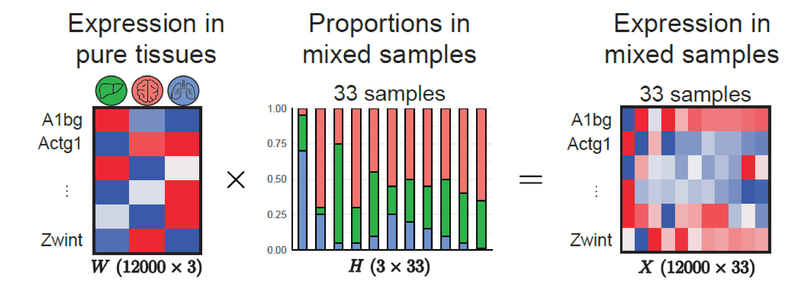
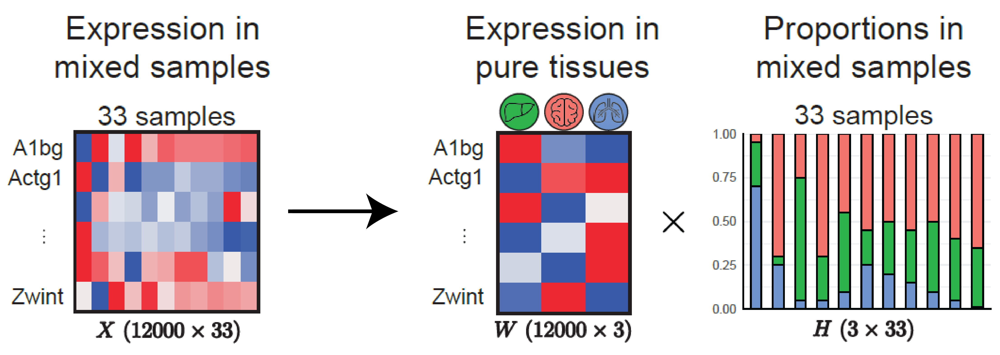
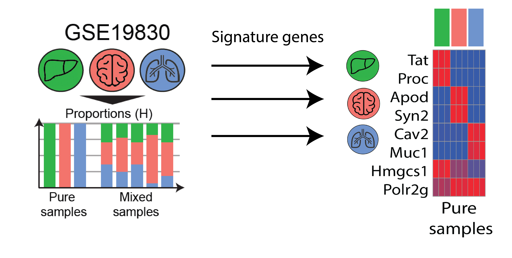
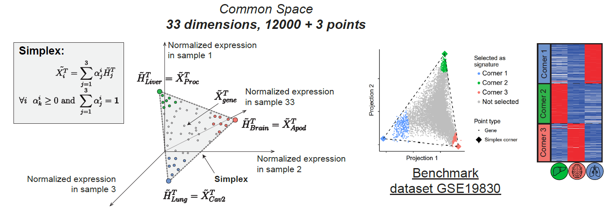
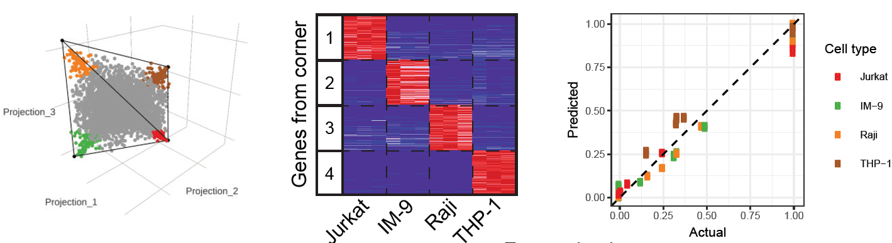

class: center, middle

# Gene expression deconvolution

---

### Different cell types have different epxression profiles



---

## Different problem

Recover cell type signatures and cell type proportions from gene expression data of mixed samples



---

## Where we can use gene expression deconvolution algorithms

* Blood datasets
* Tumor environments \ survival analysis
* Contamination detection
* Immune cell type infiltration


---

## Linear mixing model



---

## Gene expression deconvolution problem




---

## Formally

* Given observed gene expression matrix $n \times m$ where $n$ is the number of genes and $m$ is the number of samples
* Find such matrices $W (n \times k)$ and $H (k \times m)$ that
$$ X \approx W \times H; X, W, H \geq 0 $$
* (Optionally) $H$ obeys sum-to-one constraint:
$$ \forall j \sum\_{i=1}^{k}H\_{i,j} = 1 $$
* (Sum of proportions in each sample equals 1)

---

## Formally

* Formally speaking, gene expression deconvolution probles is a subset of NMF problem (non-negative matrix factorization)
* However, we require matrix factor to have be "biologically meaningfull": matrix $W$ must inform us about the expression of genes in pure cell types and matrix $H$ must inform us about the proportions of these pure cell types in mixed samples

---

## Signature genes



---

## Deconvolution algorithms

* Complete deconvolution algorithms (we know nothing but matrix)
* Partial deconvolution algorithms (we have additional information about the problem)

What can be additional information:
* Either $W$ or $H$, (or subset of $W$ or $H$)
* **Signature genes** for relevant for cell types in the mixture


---

## Deconvolution algorithms

* **Partial deconvolution algorithms** are more or less well-studies
* **Complrete deconvolution algorithms**: that's were stuff is getting complicated

---

## Current algorithms

* If we know any of matrices $H$ or $W$, then we can use some form of NNLS (non-negative least squares)
* If we know signature genes: we can easily use DSA (digital sorting algorithm)
* If we know a part of $W$ then we could use other supervised algorithms:

.small[
* **TIMER** (linear least square regression)
* **CIBERSORT** (nu support vector regression)
* **EPIC** (constrained least square regression)
* **xCell** (ssGSEA, single-sample gene set enrichment analysis)
* and many others...
]

---

## Non-negative least squares

* NNLS methods are one way or another involved in gene expression deconvolution problem
* Given we know $X$ and we know $W$ (for exampled we measures expression in pure/sorted cell subpopulations) how can we know matrix $H$ for proporitons?

Fast combinatorial non-negative least squares (FCNNLS) will minimize

.small[
$$ \min\_{H} || W \times H - X ||\_F,\ \ H \geq 0 $$
$$ || A - B ||\_F = \sum\_{i=1}^{n} \sum\_{j=1}^{m} (A\_{i,j} - B\_{i,j})^2 $$
]

---
## GSE19830

* Benchmark dataset for gene expression deconvolution algorithms
* Mixture of 3 tissues: liver, brain and lung
* mRNA abundance from pure and mixed tissue samples was measures using microarray

.center[

]

---

## All libraries for today

```{r message=F, warning=F}
if (!requireNamespace("BiocManager", quietly = TRUE)) install.packages("BiocManager")
if (!requireNamespace("GEOquery", quietly = TRUE)) BiocManager::install("GEOquery")
if (!requireNamespace("Biobase", quietly = TRUE)) BiocManager::install("Biobase")
if (!requireNamespace("ggplot2", quietly = TRUE)) install.packages("ggplot2")
if (!requireNamespace("reshape2", quietly = TRUE)) install.packages("reshape2")
if (!requireNamespace("dplyr", quietly = TRUE)) install.packages("dplyr")
if (!requireNamespace("limma", quietly = TRUE)) BiocManager::install("limma")
if (!requireNamespace("pheatmap", quietly = TRUE)) install.packages("pheatmap")
if (!requireNamespace("devtools", quietly = TRUE)) install.packages("devtools")
if (!requireNamespace("linseed", quietly = TRUE)) devtools::install_github("https://github.com/ctlab/LinSeed")

library(GEOquery)
library(Biobase)
library(limma)
library(dplyr)
library(pheatmap)
library(linseed)
library(ggplot2)
library(reshape2)

```


---
## Let's do it

```{r ,warning=FALSE, message=FALSE, cache=TRUE}


gse19830 <- getGEO("GSE19830", AnnotGPL = TRUE)[[1]]
head(pData(gse19830)[, c("geo_accession", "characteristics_ch1")])

```

---
## Let's parse proportions

```{r ,warning=FALSE, message=FALSE}

pdata <- pData(gse19830)
proportionsCharacter <- pdata$characteristics_ch1
proportions <- data.frame(
  liver=as.numeric(gsub(".* (\\d+) % Liver.*", "\\1", proportionsCharacter)),
  brain=as.numeric(gsub(".* (\\d+) % Brain.*", "\\1", proportionsCharacter)),
  lung=as.numeric(gsub(".* (\\d+) % Lung.*", "\\1", proportionsCharacter)),
  row.names=rownames(pdata)
)


```
---
## Let's parse proportions

```{r ,warning=FALSE, message=FALSE}

head(proportions)

```

---
## Let's parse proportions

```{r ,warning=FALSE, message=FALSE}

head(exprs(gse19830)[, 1:5])

```

---

## Usual microarray prep

```{r }

fData(gse19830) <- fData(gse19830)[, c("ID", "Gene symbol", "Gene ID")]
head(fData(gse19830))

```

---

## Quantile and collapsing IDs

```{r }

exprs(gse19830) <- normalizeBetweenArrays(exprs(gse19830), method="quantile")

```

---
## Moving to gene expression

```{r }
gse19830 <- gse19830[!grepl("///", fData(gse19830)$`Gene symbol`), ]
gse19830 <- gse19830[fData(gse19830)$`Gene symbol` != "", ]

fData(gse19830)$mean_expression <- apply(exprs(gse19830), 1, mean)
gse19830 <- gse19830[order(fData(gse19830)$mean_expression, decreasing = TRUE), ]
gse19830 <- gse19830[!duplicated(fData(gse19830)$`Gene ID`), ]
gse19830 <- gse19830[seq_len(12000), ]
dim(gse19830)
```

---
## How to find cell-type specific markers

* Differential expression
* But first make sure dataset is log-normalized
* Yes, limma DE: log-scale expression
* Yes, deconvolution: linear-scale expression

---

## Now the markers

* To find cell type-specific markers we have to perform DE one tissue against others
* We have to do it for all tissues

---

## Now the markers: 

```{r }
pure <- gse19830[, 1:9]
pureProportions <- proportions[1:9, ]
pData(pure)$Liver <- c("NonLiver", "Liver")[as.numeric(pureProportions$liver == 100) + 1]
pData(pure)$Brain <- c("NonBrain", "Brain")[as.numeric(pureProportions$brain == 100) + 1]
pData(pure)$Lung <- c("NonLung", "Lung")[as.numeric(pureProportions$lung == 100) + 1]
```

---

## Now the markers: limma, liver

```{r }
liver.model <- model.matrix(~0 + Liver, data=pData(pure))
fit <- lmFit(pure, liver.model)

fit2 <- contrasts.fit(fit, makeContrasts(LiverLiver - LiverNonLiver, levels=liver.model))
fit2 <- eBayes(fit2, trend = T)

de <- topTable(fit2, adjust.method="BH", number=Inf, sort.by = "P")
```
---

## Results

```{r }
head(de)
```

---

## Heatmap in pure samples

```{r warning=FALSE, message=FALSE}


markers.liver <- de %>% filter(adj.P.Val < 0.01) %>% top_n(50, logFC)
head(markers.liver)

```

---

## Heatmap in pure samples

```{r fig.height=3, fig.fullwidth=T, dev='svg', message=F}
markers.liver <- markers.liver %>% pull(ID)
pheatmap(pure[markers.liver, ], scale = "row", cluster_rows = F, cluster_cols = F)
```

---

## Lets do the same for other tissues: Brain

```{r }
brain.model <- model.matrix(~0 + Brain, data=pData(pure))
fit <- lmFit(pure, brain.model)

fit2 <- contrasts.fit(fit, makeContrasts(BrainBrain - BrainNonBrain, levels=brain.model))
fit2 <- eBayes(fit2, trend = T)

de <- topTable(fit2, adjust.method="BH", number=Inf, sort.by = "P")
markers.brain <- de %>% filter(adj.P.Val < 0.01) %>% top_n(50, logFC)
markers.brain <- markers.brain %>% pull(ID)
```

---

## Lets do the same for other tissues: Lung

```{r }
lung.model <- model.matrix(~0 + Lung, data=pData(pure))
fit <- lmFit(pure, lung.model)

fit2 <- contrasts.fit(fit, makeContrasts(LungLung - LungNonLung, levels=lung.model))
fit2 <- eBayes(fit2, trend = T)

de <- topTable(fit2, adjust.method="BH", number=Inf, sort.by = "P")
markers.lung <- de %>% filter(adj.P.Val < 0.01) %>% top_n(50, logFC)
markers.lung <- markers.lung %>% pull(ID)
```

---

## Lets look at the markers

```{r fig.height=3, fig.fullwidth=T, dev='svg', message=F}

pheatmap(pure[c(markers.liver, markers.brain, markers.lung), ], scale = "row", cluster_rows = F, cluster_cols = F)
```

---
## DSA algorithm

* "Digital sorting of complex tissues cell type-specific gene signature profiles", Zhong et al, BMC Bionformatics 2013
* Algorithm requires list of cell type-specific genes for each tissue/cell type
* Idea behind the algortihm: cell type-specific signatures will form close-to-diagonal matrix $W$ which can be used to identify proportions, and then to identify the rest of $W$
* Basically, signature genes define subset of $W$

---

## DSA algorithm:

* As you can see, expression profile of marker genes is somewhat similar to proportions
* We can average thes expression profiles to generate pseudo-proportions
* We can then use pseudo-proportions to calculate real proportions (using sum-to-one constraint)
* Then, we can calculate signature matrix

---

## Visually

```{r fig.height=3, fig.fullwidth=T, dev='svg', message=F}
pheatmap(t(proportions), cluster_rows = F, cluster_cols = F)
```

---

## Visually

```{r fig.height=3, fig.fullwidth=T, dev='svg', message=F}
pheatmap(2^exprs(gse19830)[c(markers.liver[1:3], markers.brain[1:3], markers.lung[1:3]), ], scale="row", cluster_rows = F, cluster_cols = F)
```

---

## Only mixed samples

```{r fig.height=2.5, fig.fullwidth=T, dev='svg', message=F}
mix <- exprs(gse19830)[, 10:42]
mix <- 2^mix # going to linear scale
markers <- list(
  liver=markers.liver,
  brain=markers.brain,
  lung=markers.lung
)
hist(mix[, 1])

```

---

## Running DSA

```{r }

dsaResults <- linseed:::fastDSA(mix, markers)
head(dsaResults$W)
```

---

## Running DSA

```{r }

head(dsaResults$H[, 1:6])
```

---

## Comparing proportions

```{r }

actual <- as.matrix(proportions[10:42, ]) / 100
predicted <- t(dsaResults$H)
props <- data.frame(
  Actual=as.numeric(actual),
  Predicted=as.numeric(predicted),
  Tissue=c(rep("liver", ncol(mix)), rep("brain", ncol(mix)), rep("lung", ncol(mix)))
)
head(props)

```

---
## Comparing proportions

```{r fig.height=3, fig.fullwidth=T, dev='svg', message=F}
ggplot(data=props, aes(x=Actual, y=Predicted, color=Tissue)) +
  geom_point() + geom_abline(slope=1, intercept = 0, lty=2) +
  facet_grid(~Tissue) + theme_bw() + theme(aspect.ratio = 1)

```
---

## Comparing expression in pure samples

```{r }
# fancy plots: basis
actualBasis <- cbind(
  2^rowMeans(exprs(pure)[, 1:3]),
  2^rowMeans(exprs(pure)[, 4:6]),
  2^rowMeans(exprs(pure)[, 7:9])
)
colnames(actualBasis) <- c("Liver", "Brain", "Lung")
predictedBasis <- dsaResults$W

plotData <- data.frame(
  Actual=as.numeric(actualBasis),
  Predicted=as.numeric(predictedBasis),
  Tissue=c(rep("Liver", nrow(exprs(pure))), rep("Brain", nrow(exprs(pure))), rep("Lung", nrow(exprs(pure))))
)
```

---
## Comparing expression in pure samples
  
```{r fig.height=3, fig.fullwidth=T, dev='svg', message=FALSE, warning=FALSE}
ggplot(data=plotData, aes(x=Actual, y=Predicted)) + 
  geom_hex(bins=100) + theme_bw() + facet_grid(~Tissue) +
  geom_abline(slope=1, intercept = 0, lty=2) + scale_x_log10() + scale_y_log10() +
  theme(aspect.ratio = 1)
```

---

## But this is where the magic ends

* GSE19830 is a benchmark dataset and was designed to perform nicely: tissures are transcriptionally are very different one form another
* When it comes to real data things are getting noisy and complicated

---

## Realistic scenarios

* Cell types are not "THAT" different from one to another as brain is different from lung, or brain is different from liver
* Blood cells are very-very different from neurons, for example
* Lymphocytes are very different from monocytes
* B cell are different from T cells
* CD4+ T helper cells are different from CD8+ T killer cells
* CD4+ T regulatory cells are slightly different from CD4+ effector T cells??
* These changes getting smaller and smaller and much harder to dissect

---

## Specialized algorithms: CIBERSORT

* CIBERSORT, https://cibersort.stanford.edu/, blood deconvolution

Their reference matrix LM22 describes how different genes are expressed across 22 immune cell types, and then they use nu-support vector regression algorithm to figure out the proportions.

(you can find LM22 in the files and use it yourself)

However, LM22 was designed for one microarray platform (HGU133A) and is not suitable for RNA-seq data and also for other microarray platforms

---
## Specialized algorithms: TIMER

* Tumor Immune Estimation Resource (http://cistrome.org/TIMER/)
* "TIMER is a web resource for systematical evaluations of the clinical impact of different immune cells in diverse cancer types"
* Calculates “scores” (instead of proportions) for immune cell types in the mixture. Was trained using TCGA cancer datasets

---

## Limitations of supervised/partial deconvolution methods

* You are either limited to platform or/and tissue you study
* You might have to identify marker genes yourself
* You have to know all the cell types that are present in your sample before you do the deconvolution

---

## Complete deconvolution problem

* General NMF (non-negative matrix factorization) approaches; there are methods that for given matrix $X (n \times m)$ and given $k$ can estimate such matrices $W (n \times k)$ and $H(k \times m)$ that $X \approx W \times H$, where $k$ is the number of cell types, $n$ is the number of genes and $m$ is the number of samples

General NMF, however, has several problems:
* No quarantee that this factorization is biologically relevant
* Algorithm can find one of many approximations
* How to estimate number of cell types $k$

---

## LinSeed

* LinSeed (linear subspace identification for gene expresion deconvolution)
* Developed by cool guys in our lab (me)
* We try to estimate cell type number
* We find signature genes
* We deconvolve (sometimes even without gene sigantures)

---

## Idea behind algorithm

* Miss me? I am a linear model from slide 6

.center[

]

---

## Linear subspace

.center[

]

---

## 4 cell types will make a tetrahedron

.center[

]

---
## Conclusions

* The bright future is ahead of us: soon we will be able to deconvolve any dataset
* With rapid grow of single-cell RNA-seq technologies it will be much easier to obtain cell type-specific signatures
* Partial deconvolution methods are well-studies and accurate, however, usage of every method relies on additional information about your dataset
* Complete deconvolution methods are also being developed and they already show  a lot of insights that were only possible because of unbiased approach

---

class: center, middle

# Questions?

