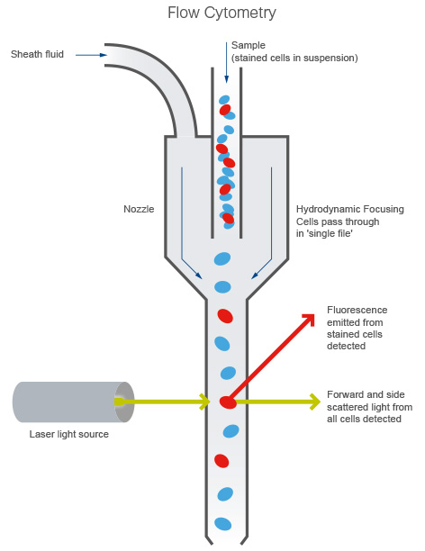
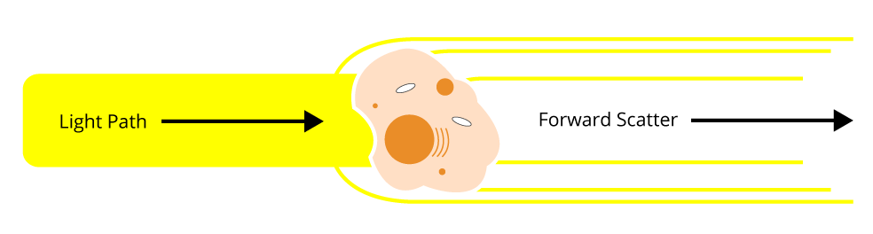
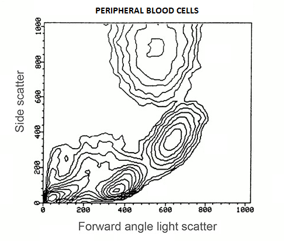
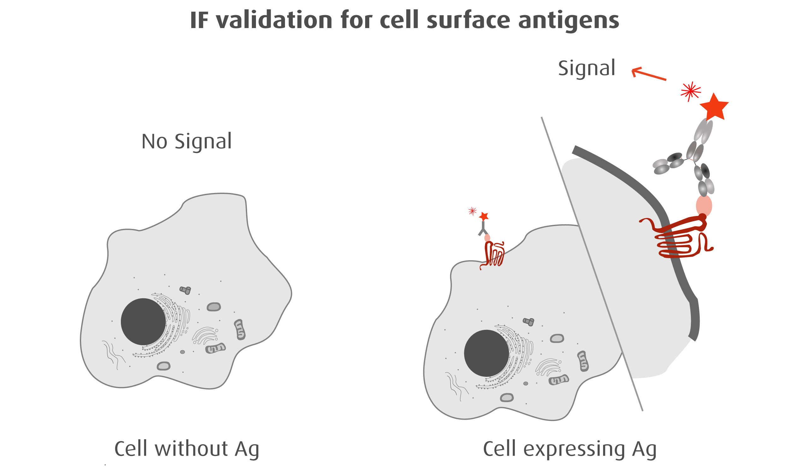
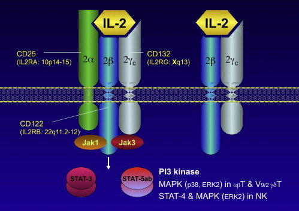
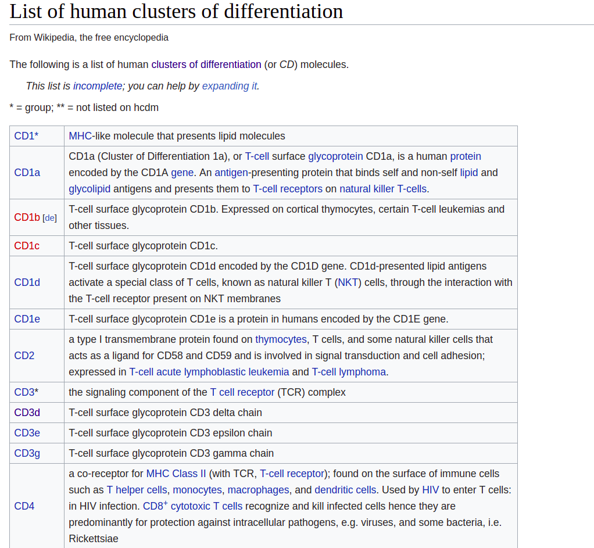

class: center, middle

# Flow cytometry

---

## Flow cytometry

* Flow cytometry and FACS are widely used techniques to capture features of cell phenotype
* Flow cytometry allows to understand size and granularity of individual cells
* FACS allows to capture protein expression for several (pre-defined) surface proteins in individual cells

---

## Flow cytometry

.pull-left[
* Sheath fluid focuses the cell suspension, causing cells to pass through a laser beam one cell at a time
* Forward and side scattered light is detected
]

.pull-right[

]

taken from https://www.abcam.com/protocols/introduction-to-flow-cytometry
 

---

## Flow cytometry

.pull-left[
Cells or particles passing through the beam scatter light, which is detected as FS and SS

* FS correlates with cell size and
* SS is proportional to the granularity of the cells
]

.pull-right[

]

In this manner, cell populations can often be distinguished based on differences in their size and granularity alone.

taken from https://www.bosterbio.com/protocol-and-troubleshooting/flow-cytometry-principle
 

---

## Flow cytometry: example

Below are dot plot and contour plot of blood cells flow cytometry.

Such plot (and density plots) are common for flow cytometry and FACS and allow cell subset identification.

taken from https://www.bosterbio.com/protocol-and-troubleshooting/flow-cytometry-principle
 

---

class: center, middle

# FACS (fluorescence-activated cell sorting)

---

## FACS (fluorescence-activated cell sorting)

* FACS adds another functionality to flow cytometry
* FACS detects expression of cell surface molecules
* For FACS we need to design panel of antibodies with specific fluorophores

---

## FACS

---

## Cell surface molecules

There are many cell surface molecules and ost of them have at least two names:

1. **Functional**:   PTPRC (Protein tyrosine phosphatase, receptor type, C)   ITGAM (Integrin alpha M)
2. **Cluster of differentiation**:    CD45, CD11b

Sometimes these genes have just a name of CD nomenclature like CD4 and CD34.

---

## Cell surface molecules

Cell surface molecules may be protein complexes: i.e. composed of products of several genes. 

.pull-center[

]

taken from https://www.sciencedirect.com/topics/immunology-and-microbiology/il-2-receptor
 
---

## Cell surface molecules

.pull-left[

* Luckily, we don't need to learn them
* Takeaway message: there are **many** cell surface molecules, and scientists very often use them to **characterize cell types**

]

.pull-right[

]

taken from https://en.wikipedia.org/wiki/Cluster_of_differentiation
 
---

## Antibodies

* An **antibody** (**Ab**), also known as an **immunoglobulin** (**Ig**), is a large, Y-shaped protein produced mainly by plasma cells that is used by the immune system to neutralize pathogens such as pathogenic bacteria and viruses
* The antibody **recognizes a unique molecule**, called an antigen, and **binds** to it
* We can engineer antibodies for cell surface molecules

Definition is taken from https://en.wikipedia.org/wiki/Antibody
 
---

## Antibodies

* 

---

