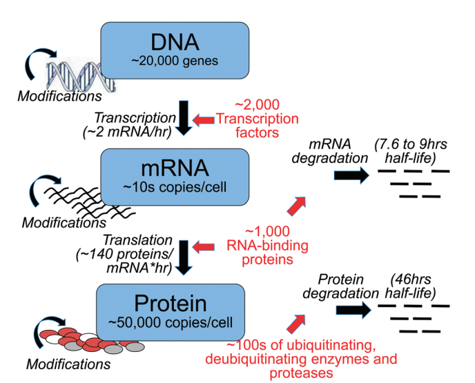
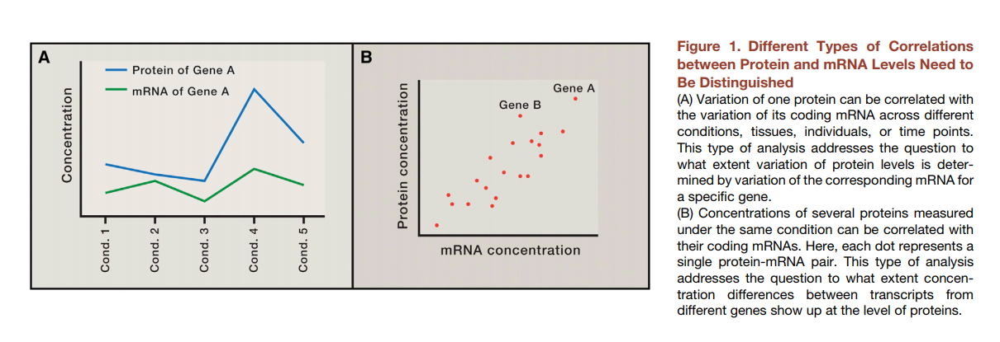

class: center, middle

# Quantification of RNA

---
## Why we measure RNA abundance

Taken from https://www.ncbi.nlm.nih.gov/pubmed/26259698
 

---
## Why we measure RNA abundance

Taken from https://www.cell.com/cell/pdf/S0092-8674(16)30270-7.pdf
 

--

* A is very often the case
* B is almost never the case

---
## Why we measure RNA abundance

* While proteins are the key players in biological processes, RNA abundance is a good enough proxy for protein abundance

* Measuring RNA abundance is **much easier**

* Given several conditions and a gene: for <strong class='red'>the same gene</strong> fold change in RNA abundance will inform us aboust fold change in protein level
---

## Example study

* Usually you have the phenotype, but you don't know why it happens
* You take samples from several conditions related to you phenotype
* You try to figure out what is different in your phenotype from the control (or other condition)
---

## Example study

What can be sample:

* Tissue sample: blood draw, biopsy
* Cells of specific cell type

---
## Structure of mRNA

* We are mostly interested in mRNA (messgenger RNA), because it is protein coding RNA
* Estimated 105 to 106 mRNA molecules per animal cell with high dynamic range for genes: from several copies to 104

https://www.ncbi.nlm.nih.gov/pmc/articles/PMC3129258/
 and https://bionumbers.hms.harvard.edu/bionumber.aspx?id=111220
 

---
## Types of RNA

* rRNA - ribosomal RNA: 80% of total cell RNA
* tRNA - transfer RNA: 15% of the cell RNA
* mRNA - messenger RNA for protein-coding genes
* Orther RNAs: miRNA, lncRNA

---
## Strategies to capture RNA

|Strategy         |	Type of RNA	    | Ribosomal RNA content	 | Unprocessed RNA content	| Genomic DNA content | Isolation method                                             |
|:----------------|:---------------:|:----------------------:|:------------------------:|:-------------------:|:------------------------------------------------------------:|
|Total  RNA       |All	            | High                   |High	                    |High	                |   None                                                       |
|PolyA selection	|Coding           |	Low	                   |Low	                      |Low	                |Hybridization with poly(dT) oligomers                         |
|rRNA depletion	  |Coding, noncoding|	Low	                   |High	                    |High	                |Removal of oligomers complementary to rRNA                    |
|RNA capture	    |Targeted	        | Low	                   |Moderate	                |Low	                |Hybridization with probes complementary to desired transcripts|

---
## Microarray

* Microarray can be considered as RNA capture technique
* Microarray consists of thousands of probes
* Probes consist of many oligonucleotides (all of which are the same within the probe)
* When cDNA hybridizes with complementary oligonucleotides, we detect fluoresence

---
## Microarray

