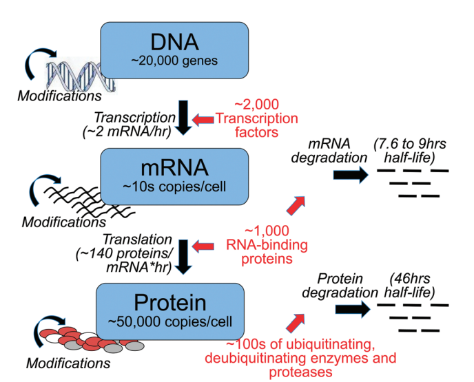

class: center, middle

# (m)RNA sequencing

---

## Why we measure RNA abundance

Taken from https://www.ncbi.nlm.nih.gov/pubmed/26259698
 

---

## Gene structure

.center[

]

Taken from http://nitro.biosci.arizona.edu/courses/EEB600A-2003/lectures/lecture24/lecture24.html
 

---

## Gene structure: translation

.center[

]

Taken from https://www.ncbi.nlm.nih.gov/pubmed/23810193
 

---

## Gene structure: translation

.center[

]

.center[

]

Taken from https://www.ncbi.nlm.nih.gov/pubmed/23810193
 

---
## Some genes are simple

.center[

]

---

## Many genes have multiple isoforms

.center[

]

---

## Most of the RNA is ribosomal RNA

.center[

]

Taken from http://hpst.cz/sites/default/files/attachments/5991-5938en.pdf
 
---

## Strategies to capture RNA

|Strategy         |	Type of RNA	    | Ribosomal RNA content	 | Unprocessed RNA content	| Genomic DNA content | Isolation method                                             |
|:----------------|:---------------:|:----------------------:|:------------------------:|:-------------------:|:------------------------------------------------------------:|
|Total  RNA       |All	            | High                   |High	                    |High	                |   None                                                       |
|PolyA selection	|Coding           |	Low	                   |Low	                      |Low	                |Hybridization with poly(dT) oligomers                         |
|rRNA depletion	  |Coding, noncoding|	Low	                   |High	                    |High	                |Removal of oligomers complementary to rRNA                    |
|RNA capture	    |Targeted	        | Low	                   |Moderate	                |Low	                |Hybridization with probes complementary to desired transcripts|

---

## Comparison

.center[

]

Taken from https://bmcgenomics.biomedcentral.com/track/pdf/10.1186/1471-2164-15-419
 
---

## What is RNA-seq

.center[

]

Taken from https://www.biostat.wisc.edu/bmi776/lectures/rnaseq.pdf
 
---

## RNA-seq

RNA-seq can be done very differently:

* 3' RNA-seq is good for measuring expression
* Full-length (paired-end) RNA-seq is good for detecting isoforms
* You can target specific sequences

Depending on what you want to do protocol steps and their order (such as fragmentation) might vary

---

## RNA-seq for gene expression

.center[

]

---

## Traditional 3' RNA-seq pipeline

.center[

]

---

## Traditional 3' RNA-seq pipeline

Once RNA is fragmented

.center[

]

---

## 3' vs full-length RNA-seq

.center[

]

---

class: center, middle

# Any questions so far?

---

## Processing RNA-seq: two cases

* Model organism with a good reference genome (human, mouse, arabidopsis, yiest)
* Non-model organism :(

.center[

]

---

## Basic RNA-seq analysis pipeline

* Alignment: raw reads (fastq) + reference genome -> bam
* Quantification: bam (aligned reads) + reference genome -> expression table
* Secondary analysis: well, that part you know already

---

## Refernce genomes

* Human: chr1-chr22, chrX, chrY, chrM: 
  * 3235 Mb, 20412 genes
* Mouse: Chr1-chr19, chrX, chrY, chrM: 
  * 2318 Mb, 23,139 genes
* Assembly is mostly complete: but not 100%, there are unplaced scffolds and gaps
* There are pseudogenes, lncRNA, rRNA and other stuff in a genome, which are usually present in the genome annotation

---

## Popular genome assemblies

* Human:
  * UCSC notation (hg19, hg38)
  * Genome reference consortium notation (major: GRCh37, minor: GRCh38.p7)
  * 1000 genomes notation (b37)
* Mouse - same (mm10, GRCm37)

---

## Gencode: my personal preference

* https://www.gencodegenes.org/
* I usually use primary assembly
.center[

]

---

## Gencode: my personal preference

.center[

]

---

## What is reference

Usually reference is just two files:

* Sequence fasta file
* GTF/GFF annotation

---

## Alignment

Usually reference is just two files:

* Sequence fasta file
* GTF/GFF annotation

---
