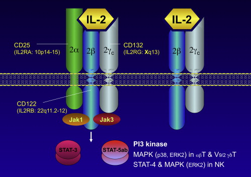

class: center, middle

# Flow cytometry

---

## Flow cytometry

* Flow cytometry and FACS are widely used techniques to capture features of cell phenotype
* Flow cytometry allows to understand size and granularity of individual cells
* FACS allows to capture protein expression for several (pre-defined) surface proteins in individual cells

---

## Flow cytometry

.pull-left[
* Sheath fluid focuses the cell suspension, causing cells to pass through a laser beam one cell at a time
* Forward and side scattered light is detected
]

.pull-right[

]

taken from https://www.abcam.com/protocols/introduction-to-flow-cytometry
 

---

## Flow cytometry

.pull-left[
Cells or particles passing through the beam scatter light, which is detected as FS and SS

* FS correlates with cell size and
* SS is proportional to the granularity of the cells
]

.pull-right[

]

In this manner, cell populations can often be distinguished based on differences in their size and granularity alone.

taken from https://www.bosterbio.com/protocol-and-troubleshooting/flow-cytometry-principle
 

---

## Flow cytometry: example

Below are dot plot and contour plot of blood cells flow cytometry.

Such plot (and density plots) are common for flow cytometry and FACS and allow cell subset identification.

taken from https://www.bosterbio.com/protocol-and-troubleshooting/flow-cytometry-principle
 

---

class: center, middle

# FACS (fluorescence-activated cell sorting)

---

## FACS (fluorescence-activated cell sorting)

* FACS adds another functionality to flow cytometry
* FACS detects expression of cell surface molecules
* For FACS we need to design panel of antibodies with specific fluorophores

---

## FACS

---

## Cell surface molecules

There are many cell surface molecules and ost of them have at least two names:

1. **Functional**:   PTPRC (Protein tyrosine phosphatase, receptor type, C)   ITGAM (Integrin alpha M)
2. **Cluster of differentiation**:    CD45, CD11b

Sometimes these genes have just a name of CD nomenclature like CD4 and CD34.

---

## Cell surface molecules

Cell surface molecules may be protein complexes: i.e. composed of products of several genes. 

.center[

]

taken from https://www.sciencedirect.com/topics/immunology-and-microbiology/il-2-receptor
 
---

## Cell surface molecules

.pull-left[

* Luckily, we don't need to learn them
* Takeaway message: there are **many** cell surface molecules, and scientists very often use them to **characterize cell types**

]

.pull-right[

]

taken from https://en.wikipedia.org/wiki/Cluster_of_differentiation
 
---

## Antibodies

* An **antibody** (**Ab**), also known as an **immunoglobulin** (**Ig**), is a large, Y-shaped protein produced mainly by plasma cells that is used by the immune system to neutralize pathogens such as pathogenic bacteria and viruses
* The antibody **recognizes a unique molecule**, called an antigen, and **binds** to it
* We can engineer antibodies for cell surface molecules

Definition is taken from https://en.wikipedia.org/wiki/Antibody
 
---

## Antibodies

* We can attach fluorophores of different colors to antibodies to figure measure the expression of surface markers in individual cells

.center[

]

---

## Fluorophores

* There are many fluoroscent molecules (fluorophores)
* These fluorescent molecules are excited by laser light at specific wavelengths and then emit light (fluoresce) at another wavelength
* By conjugating (pre-attaching) them to primary antibodies, we can create conjugated antibodies that allow for flow cytometry analysis

.center[

]

---

## Fluorophores

.center[

]

taken from https://en.wikipedia.org/wiki/Fluorophore
 
---

## Important properties of fluorophores

.tiny[
* **Maximum Excitation Wavelength (λex)** – The peak wavelength in the excitation (absorption) spectra, measured in nanometers (nm)
* **Maximum Emission Wavelength (λem)** – The peak wavelength in the emission spectra, measured in nanometers (nm)
* **Extinction Coefficient (ε max )** – (also called molar absorptivity) The capacity for the fluorochrome to absorb light at a given wavelength, usually measured at the maximum excitation wavelength with the units M −1 cm −1
* **Fluorescence Quantum Yield** (Φf) – The number of photons emitted per absorbed photon. A high quantum yield is important, and this number ranges between 0 and 1
* **Brightness** – The fluorescence output per fluorophore measured. Fluorophores with high brightness values can be used to detect lower-abundance targets. Calculated as the product of the extinction coefficient (at the relevant excitation wavelength) and the fluorescence quantum yield divided by 1000, with the units M −1 cm −1
]

---

## Quick reminder about photon energy

$$ E = \frac{hc}{\lambda} $$
Where
* $h$ is Planck constant
* $c$ is the speed of light (in vacuum)
* $\lambda$ is the photon wavelength

**Energy** of emitted photon **is always lower** than the energy of absorbed photon, so **wavelength** of emitted photon **is greater** than the wavelaength of absorbed photon. 

---

## Flow cytometry with fluorescence

.pull-left[

* So we have cell labeled with antibodies
* Antibodies for different surface molecules have different fluorophores
* **For each cell** we detect **forward scatter**, **side scatter** and **fluorescence**

]

.pull-right[

]

---

## FACS

* Unfortunately, emission light spectra overlap between similar colors
* We are limited to **7-10** antibodies per FACS experiment

.center[

]

taken from https://www.biolegend.com/en-us/multicolor-staining
 

---

## FACS

.pull-left[

When you are only given 4 flurophores, how to chose to which antibodies to conjugate?

* Basic rule: lower average expression -> greater fluorohpore brightness

]
.pull-right[

]

taken from https://www.bosterbio.com/protocol-and-troubleshooting/flow-cytometry-optimization/fluorescent-conjugates
 

---

## FACS

.center[

]

---

## FACS: sorting cells

.pull-left[

* We can charge droplets with cells based on their fluorescence
* We can put magnets that will pull differently droplets with different fluorescence into different flasks
* That's called sorting

]

.pull-right[

]

---
## Lets interpret some FACS plots

* With this knowledge about FACS and how FACS plots look like it should be much easier for you to read and look at different biological papers (especially immunological)
* Let's open Figure 1 from https://www.nature.com/articles/s41590-019-0449-3.pdf
* https://konsolerr.github.io/gene_expression_2019/facs/10.1038@s41590-019-0449-3.pdf

---

class: center, middle

# Any questions ?

