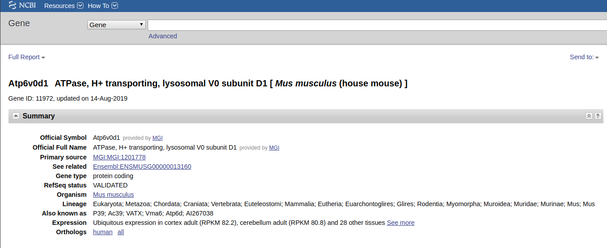

class: center, middle

# Microarrays

---

## Installing libraries for today

```{r message=F}
if (!requireNamespace("BiocManager", quietly = TRUE)) install.packages("BiocManager")
if (!requireNamespace("GEOquery", quietly = TRUE)) BiocManager::install("GEOquery")
if (!requireNamespace("Biobase", quietly = TRUE)) BiocManager::install("Biobase")
if (!requireNamespace("ggplot2", quietly = TRUE)) install.packages("ggplot2")
if (!requireNamespace("reshape2", quietly = TRUE)) install.packages("reshape2")
if (!requireNamespace("limma", quietly = TRUE)) BiocManager::install("limma")
if (!requireNamespace("MASS", quietly = TRUE)) install.packages("MASS")

library(GEOquery)
library(Biobase)
library(ggplot2)
library(reshape2)
library(limma)
library(MASS)
```

---
## GSE53986

Link to the dataset

https://www.ncbi.nlm.nih.gov/geo/query/acc.cgi?acc=GSE53986


---


## Loading the dataset

```{r cache=T, message=F}

GSE53986 <- getGEO("GSE53986", AnnotGPL = TRUE)[[1]]

```

---

## fData and pData

* fData -- feature data,  probe annotation
* pData -- phenotypcal data, sample annotaiton

Lets filter these objects and only keep things we need

---

## Filtering pdata
.tiny[
```{r }

colnames(pData(GSE53986))

```
]


---

## Filtering pdata

This one is relatively straightforward

```{r message=F}
pData(GSE53986)$rep <- gsub(".*, (\\d)$", "rep \\1", pData(GSE53986)$title)
pData(GSE53986) <- pData(GSE53986)[, c("cell type:ch1", "treatment:ch1", "rep")]

colnames(pData(GSE53986)) <- c("Cell", "Treatment", "Replicate")
head(pData(GSE53986))

```

---

## Treatment is actually two variables

* LPS: yes or no ?
* IFNg: yes or no ?

```{r }
pData(GSE53986)$LPS <- as.factor(c("no", "yes")[grepl("LPS", pData(GSE53986)$Treatment) + 1])
pData(GSE53986)$IFNg <- as.factor(c("no", "yes")[grepl("IFNg", pData(GSE53986)$Treatment) + 1])
head(pData(GSE53986))
```

---

## Filtering fdata

What do we want to keep?

```{r cache=T, message=F}
colnames(fData(GSE53986))

```

---

## Gene IDs: we are doomed

* **Gene symbol** - something meaningfull
* **Entrez ID** - https://www.ncbi.nlm.nih.gov/gene/ENTREZ_ID
* **ENSEMBL** -- just ENSEMBL, when you do RNA-seq, these IDs will show up
* RefSeq ID
* And many more

(I wanted to make a meme first, but gene id conversion is not funny at all)

---

## Filtering fdata

Lets keep ID, symbol, and entrez id

```{r message=F}
fData(GSE53986) <- fData(GSE53986)[, c("ID", "Gene symbol", "Gene ID")]
head(fData(GSE53986))

```

---

## Entrez ID

Entrez ID: https://www.ncbi.nlm.nih.gov/gene/11972

.center[
  
]

---

## Figuring out expression space

* Expression levels for each gene/probe can be in different space: linear and logarithmical space.
* Usually we determine that by looking at values (especially) maximum values
* If maximum value is < 25 we think it is in log-space
* If it is > 1000 we think it is in linear space
* (If it is somewhere in between we are usually confused)

---

## Figuring out expression space

```{r fig.height=3, fig.fullwidth=T, dev='svg'}

ggplot(data=data.frame(expression=exprs(GSE53986)[, 1]),
       aes(x=expression)) +
  geom_histogram()

```

---

## Figuring out expression space

```{r fig.height=3, fig.fullwidth=T, dev='svg', message=F}

ggplot(data=data.frame(expression_log2=log2(exprs(GSE53986)[, 1])),
       aes(x=expression_log2)) +
  geom_histogram()

```

---

## Observations

* In microarray we don't have true "zeroes"

```{r}
min(exprs(GSE53986))
```
* This means that even for non-expressed probes we detect some light intensity (background fluorescence)
* In log-scale distribution of expression values usually looks "more normal"

---

## About expression space

* Most of gene expression studies are done in log-space (we believe that error is normally distributed in log-space)
* There are some exceptions (like gene expression deconvolution, usually is done in linear space)


---

## Comparing distributions between samples

```{r fig.height=3, fig.fullwidth=T, dev='svg', message=F}

twoSamples <- melt(exprs(GSE53986[, 1:2]))
twoSamples$value <- log2(twoSamples$value)

ggplot(data=twoSamples, aes(x=value)) +
  facet_grid(~Var2) + geom_histogram()

```
---

## Comparing distributions between samples

```{r }
colSums(exprs(GSE53986))
```

---

## Quantile normalization

* Distributions are similar yet different
* Better safe than sorry: we apply quantile normalization anyway
* https://en.wikipedia.org/wiki/Quantile_normalization

---

## Quantile normalization

```{r fig.height=3, fig.fullwidth=T, dev='svg', message=F}

exprs(GSE53986) <- normalizeBetweenArrays(log2(exprs(GSE53986)+1), method="quantile")
twoSamples <- melt(exprs(GSE53986[, 1:2]))

ggplot(data=twoSamples, aes(x=value)) +
  facet_grid(~Var2) + geom_histogram()

```

---

## Moving to gene expression

* We were mostly looking at "probe-level" expression
* We would like to move to gene-level expression
* But what can happen to a probe?

---

## Moving to gene expression

Please run 

```{r eval=F}
head(fData(GSE53986), 1000)
```

---

## Moving to gene expression

* Let's remove **probes that map to several genes** (they are not measuring anything specific)
* Let's remove **probes that don't map to any gene** (they are not measuring anything useful)
* If several probes are mapped to the same gene we only take the probe with the highest average expression
* Let's only keep 12000 top expressed genes


---
## Moving to gene expression

```{r }
GSE53986 <- GSE53986[!grepl("///", fData(GSE53986)$`Gene symbol`), ]
GSE53986 <- GSE53986[fData(GSE53986)$`Gene symbol` != "", ]

fData(GSE53986)$mean_expression <- apply(exprs(GSE53986), 1, mean)
GSE53986 <- GSE53986[order(fData(GSE53986)$mean_expression, decreasing = TRUE), ]
GSE53986 <- GSE53986[!duplicated(fData(GSE53986)$`Gene ID`), ]
GSE53986 <- GSE53986[seq_len(12000), ]
dim(GSE53986)
```

---

## Whoray

* This matrix is finally something that we can analyze
* Let's do a PCA first and see how our samples are grouped

---

## PCA plot

```{r fig.height=3, fig.fullwidth=T, dev='svg', message=F}
pcas <- prcomp(t(exprs(GSE53986)), scale. = T)
plotData <- cbind(pcas$x[, 1:2], pData(GSE53986))
ggplot(plotData, aes(x=PC1, y=PC2, color=Treatment)) +
  geom_point() + theme_bw() + theme(aspect.ratio = 1)

```

---

## PCA plot: figuring out outliers

```{r fig.height=3, fig.fullwidth=T, dev='svg', message=F}
ggplot(plotData, aes(x=PC1, y=PC2, color=Treatment)) +
  geom_point() +
  geom_text(aes(label=rownames(plotData))) + theme_bw() + theme(aspect.ratio = 1)

```

---

## Variance expained:

Usually we show variance explained by components

$$ Var = \sigma^2 $$

prcomp calculates standard deviation

---

## Variance explained

```{r fig.height=3, fig.fullwidth=T, dev='svg', message=F}
variance <- pcas$sdev^2
ggplot(data=data.frame(component=1:16, variance=variance),
       aes(x=component, y=variance)) +
  geom_point() + geom_line() + theme_bw()

```

---

## Variance explained: ratio

```{r fig.height=3, fig.fullwidth=T, dev='svg', message=F}
variance <- variance / sum(variance)
ggplot(data=data.frame(component=1:16, percent=variance * 100),
       aes(x=component, y=percent)) +
  geom_point() + geom_line() + theme_bw()

```

---

## Differential expression

```{r }

GSE53986.design <- model.matrix(~0+LPS+IFNg, data=pData(GSE53986))
colnames(GSE53986.design) <- c("LPSno", "LPSyes", "IFNgyes")

fit <- lmFit(GSE53986, GSE53986.design)

fit2 <- contrasts.fit(fit, makeContrasts(LPSyes - LPSno, levels=GSE53986.design))
fit2 <- eBayes(fit2, trend = T)

de <- topTable(fit2, adjust.method="BH", number=Inf, sort.by = "P")

```

---

## Differential expression

```{r }
head(de)
```

---
## Differential expression

```{r }

GSE53986.design <- model.matrix(~0+IFNg+LPS, data=pData(GSE53986))
colnames(GSE53986.design) <- c("IFNgno", "IFNgyes", "LPSyes")

fit <- lmFit(GSE53986, GSE53986.design)

fit2 <- contrasts.fit(fit, makeContrasts(IFNgyes-IFNgno, levels=GSE53986.design))
fit2 <- eBayes(fit2, trend = T)

de <- topTable(fit2, adjust.method="BH", number=Inf, sort.by = "P")

```

---

## Differential expression

```{r }
head(de)
```


---

## Let's dig a bit into theory
<span class="red"> Spoiler alert: i am just a prorammer / bioinformatician :) You might want to consult a proper statistician </span>

.center[
  
]

---

## Simple t-test

* DE is about comparing means of several groups
* Let's know forget about previous dataset
* Lets assume we have 3 A samples and 3 B samples
* We would like to compare A vs B

---

## Comparing means: T-test

We could simply use T-test to test if means are different.

We have equal size samples, equal error variance. Good.

$$t = \frac{\bar{X_1} - \bar{X_2}}{\sqrt{\frac{s^2_{X_1} + s^2_{X_2}}{n}}}$$ 

and degrees of freedom for testing are

$$ d.f. = 2n - 2 $$


<div class="my-footer"><span>Taken from https://en.wikipedia.org/wiki/Student%27s_t-test</span></div>

---

## Simple t-test

* Even for true different (4 vs 7 with sd=1 error) genes we couldn't get P significant T-test p value
* Can we somehow empower T-test ?

---

## eBayes

* Empirical Bayes Statistics for Differential Expression

$$t = \frac{\bar{X_1} - \bar{X_2}}{\sqrt{\frac{s^2_{X_1} + s^2_{X_2}}{n}}}$$ 

* Idea is that deviations depend on $n$, t-statistic depends on $n$ and degrees of freedom depend on $n$

---
## eBayes

https://konsolerr.github.io/gene_expression_2019/microarray/smyth2004.pdf

* Since we calculate DE for many-many genes we can infer additional sample size from aggregating their deviations too


---

## Linear models

The most simple linear models are:

$$ y = kx + b $$

* We know both $y$ and $x$ and we try to predict $k$ and $b$
* Usually both $x$ and $y$ are numeric

---

## Linear models: x can be factor

Let's look at expression of gene il1rn


<a href="https://www.codecogs.com/eqnedit.php?latex=\LARGE&space;y&space;=&space;k_{pos}&space;x_{pos}&space;&plus;&space;k_{neg}&space;x_{neg}" target="_blank"></a>

where 
* $x_{pos} = 1$ and $x_{neg} = 0$ if sample is LPS treated
* $x_{pos} = 0$ and $x_{neg} = 1$ if sample is not LPS treated.


---
## Linear models: LPS

```{r }
lps_model <- model.matrix(~0 + LPS, data = pData(GSE53986))
colnames(lps_model) <- c("LPS_no", "LPS_yes")
lps_model
```

---

## Linear models fitting: 

```{r }
## il1rn
exprs(GSE53986)["1451798_at", ]
linear_fit <- lm.fit(lps_model, exprs(GSE53986)["1451798_at", ])
linear_fit$coef
```

---

## Linear models: 

We can model expression of il1rn gene as:

$ il1rn = 8.403891 $ if sample is not LPS treated

$ il1rn = 14.528120 $ if sample is LPS treated

---

## Linear models: IFNg

```{r }
ifng_model <- model.matrix(~0 + IFNg, data = pData(GSE53986))
colnames(ifng_model) <- c("ifng_no", "ifng_yes")
ifng_model
```
---

## Linear models fitting: 

```{r }
## il1rn
exprs(GSE53986)["1451798_at", ]
linear_fit <- lm.fit(ifng_model, exprs(GSE53986)["1451798_at", ])
linear_fit$coef
```

---

## Linear models fitting: 

```{r }
## Serpina3g
exprs(GSE53986)["1424923_at", ]
linear_fit <- lm.fit(ifng_model, exprs(GSE53986)["1424923_at", ])
linear_fit$coef
```
---

## Linear models: LPS + Ifng

```{r }
treatment_model <- model.matrix(~0 + LPS + IFNg, data = pData(GSE53986))
colnames(treatment_model) <- c("LPS_no", "LPS_yes", "IFNg_yes")
treatment_model
```

---

## Linear models: 

```{r }
## il1rn
exprs(GSE53986)["1451798_at", ]
linear_fit <- lm.fit(treatment_model, exprs(GSE53986)["1451798_at", ])
linear_fit$coef
```

---

## Linear models: 

```{r }
# serpina3g
exprs(GSE53986)["1424923_at", ]
linear_fit <- lm.fit(treatment_model, exprs(GSE53986)["1424923_at", ])
linear_fit$coef
```

---

## Linear models: LPS + Ifng

* Including several variables in the design allows us to calculate effects for each variable
* First variable is usually a target for differential expression
* Only the first variable will have both 0/1 effect calculated

---


## Linear models: treatment_model

```{r }
linear_fit <- lm.fit(treatment_model, exprs(GSE53986)["1451798_at", ])
linear_fit$coef

linear_fit <- lm.fit(treatment_model, exprs(GSE53986)["1424923_at", ])
linear_fit$coef
```

---

## Linear models: full model with 1

```{r }
full_model <- model.matrix(~1 + LPS + IFNg, data = pData(GSE53986))
colnames(full_model) <- c("Intercept", "LPS_yes", "IFNg_yes")
full_model
```

---

## Linear models: full model with 1

```{r }
linear_fit <- lm.fit(full_model, exprs(GSE53986)["1451798_at", ])
linear_fit$coef

linear_fit <- lm.fit(full_model, exprs(GSE53986)["1424923_at", ])
linear_fit$coef
```

---

## Linear models

* Linear models are usefull for calculating effects of variables
* ` ~ 0 + Annotation1 + Annotation2 ... ` will calculate means for both factors in Annotation1, and calculate effects for other annotations (excluding Annotation1)
* ` ~ 1 + Annotation1 + Annotation2 ... ` will calculate means for one the Annotation1 factors, and calculate effects for all annotations (including remaining factor in Annotation1)


