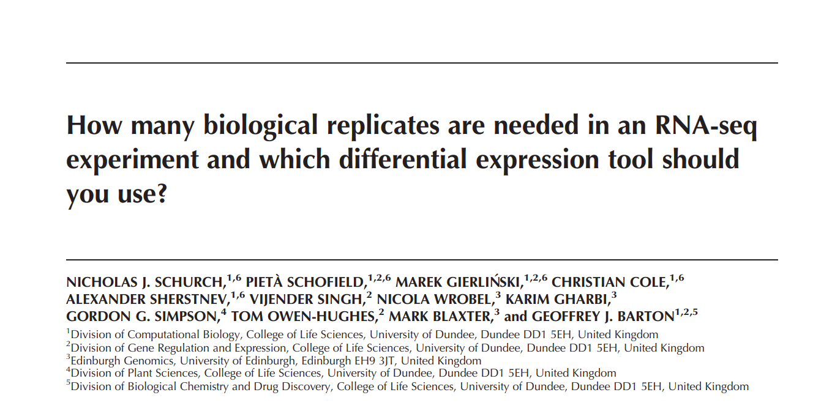
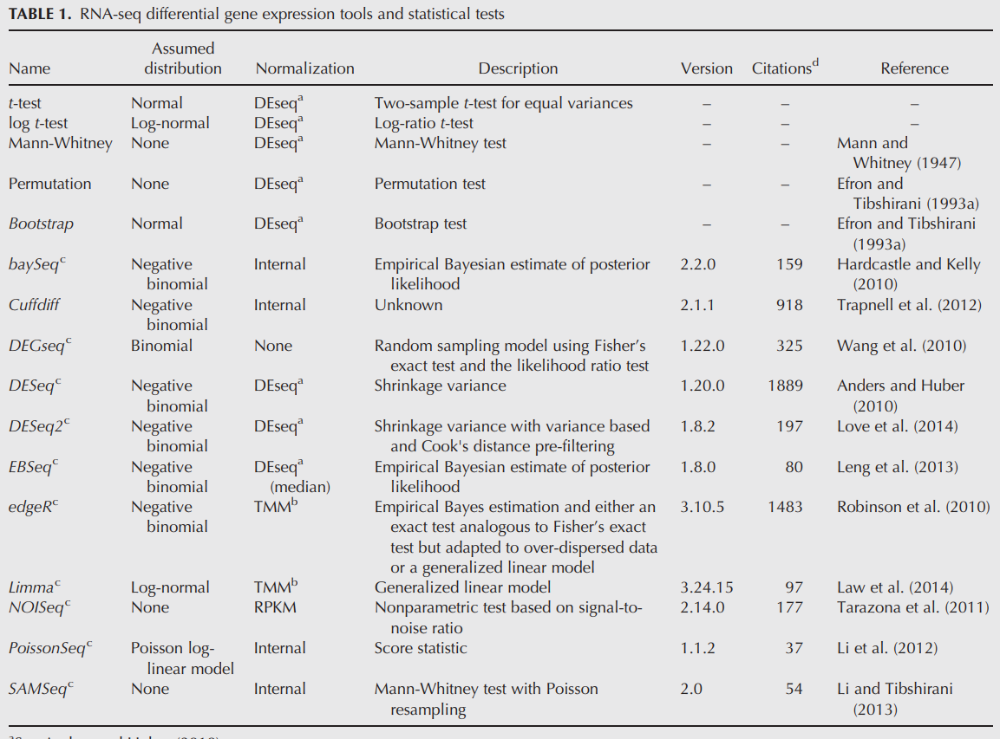

class: center, middle

# Normalizations, models

---

# Normalization

End goal for any kind of normalization is ability to perform a method (differential expression/PCA/clustering)

* We would like to make sure that variance in gene expression comes from biological variance + noise
* We would like to know how expression of a gene can be modeled: so we could perform a method
---

# RNA-seq studies



<div class="my-footer"><span>Data and some images will be taken from: https://www.ncbi.nlm.nih.gov/pmc/articles/PMC4878611/pdf/839.pdf</span></div> 

---

# RNA-seq studies



<div class="my-footer"><span>Data and some images will be taken from: https://www.ncbi.nlm.nih.gov/pmc/articles/PMC4878611/pdf/839.pdf</span></div> 

---

# Good example dataset

To make sure we can make any comparisons we first will make sense of dataset that contains many replicates of the same biological sample

* 48 replicates of the same WT strain of Saccharomyces cerevisiae

---

## Libraries

```{r message=F, warning=F}
if (!requireNamespace("BiocManager", quietly = TRUE)) install.packages("BiocManager")
if (!requireNamespace("ggplot2", quietly = TRUE)) install.packages("ggplot2")
if (!requireNamespace("ggrepel", quietly = TRUE)) install.packages("ggrepel")
if (!requireNamespace("dplyr", quietly = TRUE)) install.packages("dplyr")
if (!requireNamespace("DESeq2", quietly = TRUE)) BiocManager::install("DESeq2")
if (!requireNamespace("apeglm", quietly = TRUE)) BiocManager::install("apeglm")
if (!requireNamespace("pheatmap", quietly = TRUE)) install.packages("pheatmap")
if (!requireNamespace("vsn", quietly = TRUE)) BiocManager::install("vsn")
```

---
# Let's load the data

```{r message=F, warning=F}
library(DESeq2)
library(ggplot2)
library(vsn)
library(pheatmap)
library(ggrepel)
library(dplyr)
set.seed(1)

files <- list.files("WT_countdata", full.names = T)
sampleNames <- gsub(".*/(WT_rep\\d+_MID\\d+).*", "\\1", files)

counts <- lapply(files, function(file){
  read.table(file, sep="\t", row.names = 1, header = 0)
})
```

---

# Let's load the data

```{r message=F, warning=F}
counts <- do.call(cbind, counts)
colnames(counts) <- sampleNames
counts[c(1:6, (nrow(counts) - 6):nrow(counts)), 1:3]
```

---

# Removing unwanted lines

```{r }
counts <- counts[1:(nrow(counts) - 5), ]
dim(counts)
```

---

## First things first:

* First thing that we would like to look at is library size
* In RNA-seq library size can vary significantly from sample to sample

---
# How coverage effects analysis

```{r message=F, warning=F, fig.width=6, fig.height=3, fig.fullwidth=T, dev='svg'}

ggplot(data=data.frame(librarySize=colSums(counts)), aes(x=librarySize)) +
  geom_histogram() + theme_bw() + scale_x_log10()
```

---
# How coverage effects analysis

```{r }
sampleByCoverage <- colnames(counts)[order(colSums(counts))]
lowcov <- sampleByCoverage[1]
highcov <- sampleByCoverage[length(sampleByCoverage)]
```

---
# How coverage effects analysis

```{r message=F, warning=F, fig.width=6, fig.height=3, fig.fullwidth=T, dev='svg'}
ggplot(data=data.frame(highcov=counts[, highcov], 
                       lowcov=counts[, lowcov]), 
       aes(x=lowcov, y=highcov)) +
  geom_point() + theme_bw() + scale_x_log10() + scale_y_log10()
```

---

## Understanding counts and expression levels

Counts are amazing: 
* Within one sample: more counts a gene have, higher expression of a gene
* Counts represent number of reads aligned to a gene

Count are not amazing:
* We can not compare counts between two samples (due to library size)
* Actual "gene expression" is relative


---

# Going relative

Usually when we go to relative level we have to take into account at least two things:

* Library size
* Gene size


---

## Why gene size matters

.center[

]


---
## Does gene size always matter?

Library preparation, however, might be different:
.small[
* If we do full size sequencing (i.e. poly A selection -> reverse transcription -> fragmentation), then we have to account for gene size: number of reads is number of fragments per cDNA molecule * number of cDNA molecules
* If we sequence 3' for example: (i.e. fragmentation -> poly A selection -> reverse transcription), actual "gene size" is almost the same for all the genes => number of reads is a constant * number of cDNA molecules
* If we sequence with UMIs (unique molecule identifiers) constant above becomes 1
]

---

## Does gene size always matter?

.center[

]

---
## Simple way: RPM - reads per million

Let's assume:
.small[
* $X$ is a counts matrix, $x_{i, j}$ is the number of reads of gene $i$ in sample $j$
* $l_j = \sum_{i=1}^{genes}{x_{i, j}}$ is a library size (sum of all reads per sample)
* Scaling factor is calculated simply: 
$$ f\_j = \frac{l\_j}{1 000 000} $$
* Scaled values are calculated easily:
$$ \tilde{x}\_{i, j} = \frac{x\_{i, j}}{f\_j} = x\_{i, j} \frac{1 000 000}{l\_j}$$
]

---

## RPKM/FPKM

.small[
* Assume we have full-length sequencing
* $g_i$ is a the size of a gene $i$ in kilobases (K)
* Reads Per Kilobase Million (RPKM) are RPM devided by gene size:
$$ \tilde{x}\_{i, j} = \frac{x\_{i, j}}{f\_j g\_i} = \frac{x\_{i, j}}{g\_i} \frac{1 000 000}{l\_j}$$
* FPKM (fragments per kilobase million) is the same thing but for paired-end sequensing we will count fragments instead of reads
]


<div class="my-footer"><span>Best link to read about it is https://www.rna-seqblog.com/rpkm-fpkm-and-tpm-clearly-explained/</span></div> 

---

## TPM (Transcripts Per Kilobase Million)

.small[
TPM is pretty much the same, but the order is different: we first normalize for gene length and then calculate scaling factor
* We first calculate RPK (reads per kilobase):
$\tilde{{x}_{i, j}} = \frac{x_{i, j}}{g_i}$
* Library size is calculated for adjusted values:
$\tilde{l_j} = \sum_{i=1}^{genes}{\tilde{x_{i, j}}}$
* TPM are RPK devided by per million scaling factor:
$$ \bar{x}\_{i, j} = \tilde{x}\_{i, j} \frac{1 000 000}{\tilde{l\_j}} = \frac{x\_{i, j}}{g\_i} \frac{1 000 000}{\tilde{l\_j}} $$
]


<div class="my-footer"><span>Best link to read about it is https://www.rna-seqblog.com/rpkm-fpkm-and-tpm-clearly-explained/</span></div> 

---

## RPM/RPKM/FPKM/TPM????

* RPM/TPM guarantees that after normalization sum of normalized counts will be the same (1 000 000)
* TPM also accounts for gene size
* General advice: we use TPM and we suggest you also use TPM if you need normalized data in linear scale

---

## Lets compare RPM counts

```{r message=F, warning=F, fig.width=6, fig.height=3, fig.fullwidth=T, dev='svg'}
ggplot(data=data.frame(highcov= 1000000 * counts[, highcov] / sum(counts[, highcov]), 
                       lowcov=  1000000 * counts[, lowcov] / sum(counts[, lowcov])), 
       aes(x=lowcov, y=highcov)) +
  geom_point() + theme_bw() + scale_x_log10() + scale_y_log10()
```

---

## Lowly expressed genes are noisy

Relative expression is something very similar to probability:

* If gene A has an RPM of 10 000 (out of 1 000 000), it means that if you took a random read from this sample, probability of this read being aligned to gene A is 0.01
* When it comes to lowly expressed genes these probabilities are very low
* When it comes to lowly expressed genes signal becomes noisy

---

## Before we start let's create DESeq2 object

```{r message=F, warning=F, fig.width=8, fig.height=3, fig.fullwidth=T, dev='svg'}
dds <- DESeqDataSetFromMatrix(counts, 
                              data.frame(strain=rep("WT", ncol(counts)),
                                         libsize=colSums(counts),
                                         sampleName=sampleNames,
                                         row.names = sampleNames), design=~1)
dds <- dds[rowSums(counts(dds)) > 0, ]
dds <- DESeq(dds)
```

---

## Before we start let's create DESeq2 object

```{r message=F, warning=F, fig.width=4, fig.height=3, fig.fullwidth=T, dev='svg', fig.show="hold"}
hist(log10(colSums(counts(dds))), main = "Library size")
hist(log10(colSums(counts(dds, normalized=T))), main = "Adjusted library size")
```

---

## Methods and normalizations:

Usual log-transformation: log2(x + 1):
* Keeps values positive
* Easy to interpret
* A lot of noise in lowly abundant trasncripts
* Don't use for DE or PCA (because of the variance issues)

It is ok to use for heatmaps, if you only want to highlight serveral genes that are DE

---

## Usual log2 transform

```{r, message=F, warning=F, fig.width=4, fig.height=2.8, fig.fullwidth=T, dev='svg', fig.show="hold"}

ntd <- normTransform(dds)
meanSdPlot(assay(ntd), ranks = F)
meanSdPlot(assay(ntd)) + theme_bw()
```

---
## Usual log2 transform

* Lowly expressed genes explain to much variance for PCA
* Lowly expressed genes might be hard to interpret on a heatmap
* Sometimes we filter lowly expressed genes (as we did with microarray), however, choosing a threshold is also a complicated task

---

## Regularized log transformation

* Regularized log2 transformation shrinks dispersions towards gene expression mean
* Let's denote $q_{i, j}$ is a parameter proportional to the expected true concentration of fragments for gene $i$ and sample $j$
* We will fit generalized linear model (yeah, again): $log2(q_{i, j}) = \beta_{i, 0} + \beta_{i, j}$
* $\beta_{i, 0}$ is a gene mean expression and will won't be shrunk, $\beta_{i,j}$ is the sample-specific effect which is shrunk toward zero based on the dispersion-mean trend over the entire dataset

---
## Regularized log transformation

* Easy to interpret
* Might contain negative value for lowly abundant transcripts
* Variance is **shrunk** for lowly abundant transcripts
* Lowly abundunt transcript will not introduce variance
* OK for: PCA, Heatmaps
* Great: when you try to cluster samples hierarchically on a heatmap

---

## Regularized log transformation

```{r, message=F, warning=F, fig.width=4, fig.height=3, fig.fullwidth=T, dev='svg', fig.show="hold", cache=T}

rld <- rlogTransformation(dds)
meanSdPlot(assay(rld), ranks = F)
meanSdPlot(assay(rld)) + theme_bw()
```

---

## Variance stabilizing transformation 

* Some methods (like PCA) require that your data is kinda "in the same scale"
* PCA calculates variance that comes from changes in gene expression, and find principal component based on that variance
* If lowly expressed genes introduced too much variance into PCA then our analysis is biased
* If lowly expressed genes introduced too little variance into PCA then our analysis is biased
* Variance stabilizing transformation is a solution
* Almost the same mechanism as rlog but dispersion is shrunk using global experiment-wide trend (but not gene-wise levels)

---

## Variance stabilizing transformation 

* A bit harder to interpret (minimal value is 3.52 for example, what does that mean ??)
* Variance is **shrunk** for all the transcripts to the same level
* All transcripts introduce variance
* Great for PCA

---

## Variance stabilizing transformation 

```{r, message=F, warning=F, fig.width=4, fig.height=3, fig.fullwidth=T, dev='svg', fig.show="hold", cache=T}

vsd <- varianceStabilizingTransformation(dds)
meanSdPlot(assay(vsd), ranks = F) 
meanSdPlot(assay(vsd)) + theme_bw()
```

---
## Comparing PCAs

```{r, message=F, warning=F, fig.width=3, fig.height=3, fig.fullwidth=T, dev='svg', fig.show="hold"}

plotPCA(ntd, "libsize") + theme_bw()
plotPCA(rld, "libsize") + theme_bw()
plotPCA(vsd, "libsize") + theme_bw()
```

---
## Comparing PCAs

```{r, message=F, warning=F, fig.width=5, fig.height=4, dev='svg', fig.show="hold"}

plotPCA(vsd, "libsize") + geom_text_repel(aes(label=name), size=2) + theme_bw()
```

---

## Once we done with one condition

* We can start making comparisons
* But before we do that, lets also look if KO samples have outliers

---
## KO samples

```{r }
filesSnf2 <- list.files("Snf2_countdata", full.names = T)
sampleNamesSnf2 <- gsub(".*/(Snf2_rep\\d+_MID\\d+).*", "\\1", filesSnf2)

countsSnf2 <- lapply(filesSnf2, function(file){
  read.table(file, sep="\t", row.names = 1, header = 0)
})

countsSnf2 <- do.call(cbind, countsSnf2)
colnames(countsSnf2) <- sampleNamesSnf2
countsSnf2 <- countsSnf2[1:(nrow(countsSnf2) - 5), ]
dim(countsSnf2)
```
---

## Before we start let's create DESeq2 object

```{r message=F, warning=F}
ddsSnf2 <- DESeqDataSetFromMatrix(countsSnf2, 
                              data.frame(strain=rep("snf2_ko", ncol(countsSnf2)),
                                         libsize=colSums(countsSnf2),
                                         sampleName=sampleNamesSnf2,
                                         row.names = sampleNamesSnf2), design=~1)
ddsSnf2 <- ddsSnf2[rowSums(counts(ddsSnf2)) > 0, ]
ddsSnf2 <- DESeq(ddsSnf2)
ntdSnf2 <- normTransform(ddsSnf2)
rldSnf2 <- rlogTransformation(ddsSnf2)
vsdSnf2 <- varianceStabilizingTransformation(ddsSnf2)
```
---
## Comparing PCAs

.small[
```{r, message=F, warning=F, fig.width=3, fig.height=3.5, fig.fullwidth=T, dev='svg', fig.show="hold"}

plotPCA(ntdSnf2, "libsize") + theme_bw() + theme(aspect.ratio = 1)
plotPCA(rldSnf2, "libsize") + theme_bw() + theme(aspect.ratio = 1)
plotPCA(vsdSnf2, "libsize") + theme_bw() + theme(aspect.ratio = 1)
```
]

---
## Comparing PCAs

```{r, message=F, warning=F, fig.width=5, fig.height=4, dev='svg', fig.show="hold"}

plotPCA(vsdSnf2, "libsize") + geom_text_repel(aes(label=name), size=2) + theme_bw() + theme(aspect.ratio = 1)
```

---

## Lets combine the datasets together without outliers

```{r message=F, warning=F}
counts <- counts[, -c(21, 22, 25, 28)]
counts <- counts[, sample(ncol(counts), 5)]
countsSnf2 <- countsSnf2[, -c(6, 13, 35)]
countsSnf2 <- countsSnf2[, sample(ncol(countsSnf2), 5)]

ddsMerged <- DESeqDataSetFromMatrix(
  cbind(counts, countsSnf2), 
  data.frame(strain=c(rep("wt", ncol(counts)), rep("snf2_ko", ncol(countsSnf2))),
            libsize=c(colSums(counts), colSums(countsSnf2)),
            sampleName=c(colnames(counts), colnames(countsSnf2))), 
  design=~strain)
ddsMerged <- ddsMerged[rowSums(counts(ddsMerged)) > 0, ]
ddsMerged <- DESeq(ddsMerged)
ntdMerged <- normTransform(ddsMerged)
rldMerged <- rlogTransformation(ddsMerged)
vsdMerged <- varianceStabilizingTransformation(ddsMerged)
```

---

## Lets combine the datasets together without outliers

```{r, message=F, warning=F, fig.width=4, fig.height=4, fig.fullwidth=T, dev='svg', fig.show="hold"}
plotPCA(ntdMerged, "strain") + theme_bw()
plotPCA(vsdMerged, "strain") + theme_bw()
```

---
## Probabilites and NB-distribution

For differential expression we don't need to normalize expression values: we can try to understand the probabilities from count data

* Negitive binomial (NB) distribution
* NB(r, p): "is a discrete probability distribution of the number of successes in a sequence of independent and identically distributed Bernoulli trials before a specified (non-random) number of failures (denoted r) occurs"

<div class="my-footer"><span>Wiki,  https://en.wikipedia.org/wiki/Negative_binomial_distribution</span></div> 

---

## NB(r, p)

* Let's assume I take one read at a time from all the reads that come from sample $j$
* If a read I take is coming from gene $i$, it's a success
* If not, it's a failure
* p - probability of read to be from a gene $j$ (probability of success)
* p - is something very close to true expression

<div class="my-footer"><span>Wiki,  https://en.wikipedia.org/wiki/Negative_binomial_distribution</span></div> 

---

## Lets play a bit in R

* Careful, in R, $NB(r, p)$ returns number of **failures** and $r$ is number of successes
* Simple dice example: we roll the dice, if the number of the dice is 5 or 6, we win
* How many times wil we lose, before we win 5 times?

---
## Lets play a bit in R

* Careful, in R, $NB(r, p)$ returns number of **failures** and $r$ is number of successes
```{r message=F, warning=F, fig.width=8, fig.height=3, fig.fullwidth=T, dev='svg'}
plot(dnbinom(1:40, size=5, prob=1/3))
```

---
## Lets play a bit in R

* However, in R, $NB(r, 1 - p)$ will return number of **successes** if $r$ is number of failures
```{r message=F, warning=F, fig.width=8, fig.height=3, fig.fullwidth=T, dev='svg'}
plot(dnbinom(1:40, size=10, prob=1 - 1/3))
```

---
## Gene expression question

* Given that gene is lowly expressed gene i.e. $p=10^{-6}$, and we sequence reads one at a time
* How many reads from this gene I will I sequence before I sequence 10 000 000 reads that are not from this gene?

---

## Gene expression question: 10 000 000 reads

```{r message=F, warning=F, fig.width=8, fig.height=4, fig.fullwidth=T, dev='svg'}
hist(rnbinom(100, size=1e+7, prob=1 - 1e-6))
```

---

## Gene expression question: 1 000 000 reads

```{r message=F, warning=F, fig.width=8, fig.height=4, fig.fullwidth=T, dev='svg'}
hist(rnbinom(100, size=1e+6, prob=1 - 1e-6))
```

---

## Gene expression question: 100 000 reads

```{r message=F, warning=F, fig.width=8, fig.height=4, fig.fullwidth=T, dev='svg'}
hist(rnbinom(100, size=1e+5, prob=1 - 1e-6))
```

---
## NB(r, p)

For $NB(r, p)$ we know both the mean and variance based on $r$ and $p$. For $X \sim NB(r, p)$

* Mean: $E[X] = \frac{pr}{1 - p}$
* Variance: $Var(x) = \frac{pr}{(1 - p)^2}$

This is extremely useful, because we can model our distrubiton using mean and variance (which are easier to calculate) and then get $r$ and $p$ if needed

---

## Spoiler: next slide is complicated even for me

.center[

]

---

## Differential expression

.small[
Now that we know how NB works, lets look at how DESeq2 calculates DE (for 2 conditions A vs B):
$$ K\_{i, j} \sim NB(\mu\_{i, j}, \alpha\_i) $$
$$ \mu\_{i, j} = s\_{j}\  p\_{i, j} $$
$$ log2(p\_{i, j}) = x\_{j, A} \beta \ \_{i, A} +  x\_{j, B} \  \beta\_{i, B}$$
]

.tiny[
* Where, $K_{i, j}$ is matrix of observed counts (known), 
* $\mu_{i, j}$ is a mean for NB distribuion,
* $p_{i, j}$ is a probability to get read $i$ from sample $j$
* $s_j$ is a scaling factor (will be calculated), $\alpha_i$ are gene dispersions (will be calculated),
* matrix $x$ is model coefficients (zero or one depending on conditions) and most importantly
* $\beta_{i, j}$ probability to get read from gene $i$ if a sample is from condition
]

---

## Differential expression

.small[
Now that we know how NB works, lets look at how DESeq2 calculates DE (for 2 conditions A vs B):
$$ K\_{i, j} \sim NB(\mu\_{i, j}, \alpha\_i) $$
$$ \mu\_{i, j} = s\_{j}\  p\_{i, j} $$
$$ log2(p\_{i, j}) = x\_{j, A} \beta \ \_{i, A} +  x\_{j, B} \  \beta\_{i, B}$$
]

DESeq2 works as follows
.tiny[
1. estimation of size factors $s_j$ by estimateSizeFactors
2. estimation of dispersion $\alpha_i$ by estimateDispersions
3. negative binomial GLM fitting for $\beta_A$ and $\beta_B$ and Wald statistics by nbinomWaldTest
]

---

## Differential expression

Wald test will compare contrast (difference) of these two $\beta_A$ and $\beta_B$:

$$ \sqrt(W) = \frac{(\beta\_A - \beta\_B)}{se(\beta\_A - \beta\_B)} $$
* $\sqrt(W)$ will follow standard normal distribution and we can calculate p value using this statistic
* P value are corrected using Benjamini Hochberg (BH) correction

---

## Running DE

```{r message=FALSE, warning=F, fig.show = 'hold', fig.width=6, fig.height=3, fig.fullwidth=T, dev='svg'}
res <- results(ddsMerged)
res <- as.data.frame(res)
res$gene <- rownames(res)
ggplot(res, aes(x=log2FoldChange, y=-log10(padj), color=padj < 0.05)) +
  geom_point() + theme_bw() + scale_color_manual(values=c("black", "red"))
  # geom_text_repel(data=res %>% dplyr::filter(padj < 1e-40), aes(label=gene, color=NULL))

```


---

## Running DE: LFC shrink

```{r message=FALSE, warning=F, fig.show = 'hold', fig.width=6, fig.height=3, fig.fullwidth=T, dev='svg'}
res <- lfcShrink(ddsMerged, coef="strain_wt_vs_snf2_ko", type="apeglm")
res <- as.data.frame(res)
res$gene <- rownames(res)
ggplot(res, aes(x=log2FoldChange, y=-log10(padj), color=padj < 0.05)) +
  geom_point() + theme_bw() + scale_color_manual(values=c("black", "red"))
  # geom_text_repel(data=res %>% dplyr::filter(padj < 1e-40), aes(label=gene, color=NULL))
```

---

## Questions?