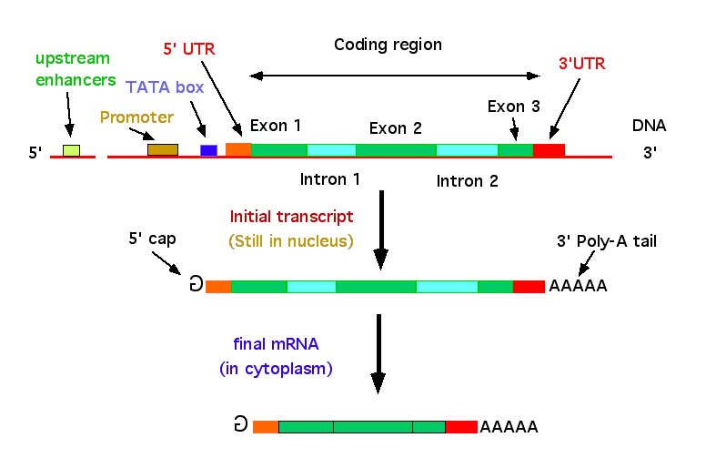
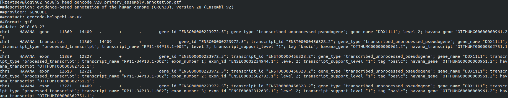

class: center, middle

# (m)RNA sequencing

---

## Why we measure RNA abundance


<div class="my-footer"><span>Taken from https://www.ncbi.nlm.nih.gov/pubmed/26259698</span></div> 

---

## Gene structure

.center[

]


<div class="my-footer"><span>Taken from http://nitro.biosci.arizona.edu/courses/EEB600A-2003/lectures/lecture24/lecture24.html</span></div> 

---

## Gene structure: translation

.center[

]


<div class="my-footer"><span>Taken from https://www.ncbi.nlm.nih.gov/pubmed/23810193</span></div> 

---


## Gene structure: translation

.center[

]

.center[

]


<div class="my-footer"><span>Taken from https://www.ncbi.nlm.nih.gov/pubmed/23810193</span></div> 

---
## Some genes are simple

.center[

]

---

## Many genes have multiple isoforms

.center[

]

---


## Most of the RNA is ribosomal RNA

.center[

]


<div class="my-footer"><span>Taken from http://hpst.cz/sites/default/files/attachments/5991-5938en.pdf</span></div> 
---


## Strategies to capture RNA

|Strategy         |	Type of RNA	    | Ribosomal RNA content	 | Unprocessed RNA content	| Genomic DNA content | Isolation method                                             |
|:----------------|:---------------:|:----------------------:|:------------------------:|:-------------------:|:------------------------------------------------------------:|
|Total  RNA       |All	            | High                   |High	                    |High	                |   None                                                       |
|PolyA selection	|Coding           |	Low	                   |Low	                      |Low	                |Hybridization with poly(dT) oligomers                         |
|rRNA depletion	  |Coding, noncoding|	Low	                   |High	                    |High	                |Removal of oligomers complementary to rRNA                    |
|RNA capture	    |Targeted	        | Low	                   |Moderate	                |Low	                |Hybridization with probes complementary to desired transcripts|

---

## Comparison

.center[

]


<div class="my-footer"><span>Taken from https://bmcgenomics.biomedcentral.com/track/pdf/10.1186/1471-2164-15-419</span></div> 
---

## What is RNA-seq

.center[

]


<div class="my-footer"><span>Taken from https://www.biostat.wisc.edu/bmi776/lectures/rnaseq.pdf</span></div> 
---

## RNA-seq

RNA-seq can be done very differently:

* 3' RNA-seq is good for measuring expression
* Full-length (paired-end) RNA-seq is good for detecting isoforms
* You can target specific sequences

Depending on what you want to do protocol steps and their order (such as fragmentation) might vary


---

## RNA-seq for gene expression

.center[

]


---

## Traditional 3' RNA-seq pipeline

.center[

]


---

## Traditional 3' RNA-seq pipeline

Once RNA is fragmented

.center[

]


---

## 3' vs full-length RNA-seq


.center[

]

---

class: center, middle

# Any questions so far?

---

## Processing RNA-seq: two cases

* Model organism with a good reference genome (human, mouse, arabidopsis, yeast)
* Non-model organism :(

.center[

]


---

## Basic RNA-seq analysis pipeline

* Usually we can live without clipping/trimming
* Alignment: raw reads (fastq) + reference genome -> bam
* Quantification: bam (aligned reads) + reference genome -> expression table
* Secondary analysis: well, that part you know already

---

## Refernce genomes

* Human: chr1-chr22, chrX, chrY, chrM: 
  * 3235 Mb, 20412 genes
* Mouse: Chr1-chr19, chrX, chrY, chrM: 
  * 2318 Mb, 23,139 genes
* Assembly is mostly complete: but not 100%, there are unplaced scaffolds and gaps
* There are pseudogenes, lncRNA, rRNA and other stuff in a genome, which are usually present in the genome annotation

---

## Popular genome assemblies

* Human:
  * UCSC notation (hg19, hg38)
  * Genome reference consortium notation (major: GRCh37, minor: GRCh38.p7)
  * 1000 genomes notation (b37)
* Mouse - same (mm10, GRCm37)

---

## Gencode: my personal preference

* https://www.gencodegenes.org/
* I usually use primary assembly
.center[

]

---

## Gencode: my personal preference

.center[

]

---

## What is reference

Usually reference is just two files:

* Sequence fasta file
* GTF/GFF annotation

---

## Sequence Fasta files

```
[kzaytsev@login02 hg38]$ head -4 GRCh38.primary_assembly.genome.fa
>chr1 1
NNNNNNNNNNNNNNNNNNNNNNNNNNNNNNNNNNNNNNNNNNNNNNNNNNNNNNNNNNNN
NNNNNNNNNNNNNNNNNNNNNNNNNNNNNNNNNNNNNNNNNNNNNNNNNNNNNNNNNNNN
NNNNNNNNNNNNNNNNNNNNNNNNNNNNNNNNNNNNNNNNNNNNNNNNNNNNNNNNNNNN
[kzaytsev@login02 hg38]$ head -500 GRCh38.primary_assembly.genome.fa | tail -4
GGCTCCTCCGGGCAGCCCTCGCCCGGGGTGCGCCCCGGGGCAGGACCCCCAGCCCACGCC
CAGGGCCCGCCCCTGCCCTCCAGCCCTACGCCTTGACCCGCTTTCCTGCGTCTCTCAGCC
TACCTGACCTTGTCTTTACCTCTGTGGGCAGCTCCCTTGTGATCTGCTTAGTTCCCACCC
CCCTTTAAGAATTCAATAGAGAAGCCAGACGCAAAACTACAGATATCGTATGAGTCCAGT
```

---

## GTF Annotation file


```
[kzaytsev@login02 hg38]$ head gencode.v28.primary_assembly.annotation.gtf
##description: evidence-based annotation of the human genome (GRCh38), version 28 (Ensembl 92)
##provider: GENCODE
##contact: gencode-help@ebi.ac.uk
##format: gtf
##date: 2018-03-23
chr1    HAVANA  gene    11869   14409   .       +       .       gene_id "ENSG00000223972.5"; gene_type "transcribed_unprocessed_pseudogene"; gene_name "DDX11L1"; level 2; havana_gene "OTTHUMG00000000961.2";
chr1    HAVANA  transcript      11869   14409   .       +       .       gene_id "ENSG00000223972.5"; transcript_id "ENST00000456328.2"; gene_type "transcribed_unprocessed_pseudogene"; gene_name "DDX11L1"; transcript_type "processed_transcript"; transcript_name "RP11-34P13.1-002"; level 2; transcript_support_level "1"; tag "basic"; havana_gene "OTTHUMG00000000961.2"; havana_transcript "OTTHUMT00000362751.1";
chr1    HAVANA  exon    11869   12227   .       +       .       gene_id "ENSG00000223972.5"; transcript_id "ENST00000456328.2"; gene_type "transcribed_unprocessed_pseudogene"; gene_name "DDX11L1"; transcript_type "processed_transcript"; transcript_name "RP11-34P13.1-002"; exon_number 1; exon_id "ENSE00002234944.1"; level 2; transcript_support_level "1"; tag "basic"; havana_gene "OTTHUMG00000000961.2"; havana_transcript "OTTHUMT00000362751.1";
chr1    HAVANA  exon    12613   12721   .       +       .       gene_id "ENSG00000223972.5"; transcript_id "ENST00000456328.2"; gene_type "transcribed_unprocessed_pseudogene"; gene_name "DDX11L1"; transcript_type "processed_transcript"; transcript_name "RP11-34P13.1-002"; exon_number 2; exon_id "ENSE00003582793.1"; level 2; transcript_support_level "1"; tag "basic"; havana_gene "OTTHUMG00000000961.2"; havana_transcript "OTTHUMT00000362751.1";
chr1    HAVANA  exon    13221   14409   .       +       .       gene_id "ENSG00000223972.5"; transcript_id "ENST00000456328.2"; gene_type "transcribed_unprocessed_pseudogene"; gene_name "DDX11L1"; transcript_type "processed_transcript"; transcript_name "RP11-34P13.1-002"; exon_number 3; exon_id "ENSE00002312635.1"; level 2; transcript_support_level "1"; tag "basic"; havana_gene "OTTHUMG00000000961.2"; havana_transcript "OTTHUMT00000362751.1";
```
---

## GTF Annotation file

.center[

]


---


## Fastq files

Raw sequencing files are FastQ files files

```
[kzaytsev@login02 askembefore]$ zcat foam_01_TACAGAC.fq.gz | head -12
@J00136:207:HLNWCBBXX:2:1101:1194:1068 1:N:0:NACAGAC
NGGGCGGATACAGAGAATAGCTTTTAAAGTGTTCTATGTTCCCAGGGGCA
+
#AAFFJJJJJJJJFJJFJJJJJJFFJJJF<JJ-FFF<-<FFJJFJJJJJF
@J00136:207:HLNWCBBXX:2:1101:1215:1068 1:N:0:NACAGAC
NTGCTCATCCTGGCTTACGTCATTGGGTGTGTGTTCGTGTGGGAAAAGGG
+
#<-A<AFAJ<<<FJJFJFF-FA7AFJF-7-7-<--<<-<JJ-7A-<7A-A
@J00136:207:HLNWCBBXX:2:1101:1357:1068 1:N:0:NACAGAC
NGTGGCTCTGGAGGGCGTAGGCCACTTCTTCCGCGAAGTGGCCGAGGAGA
+
#AAFFFFJJFJFJJJAFJJ<FFJFJJJ<<FJJ<JJJF-<AAFJFJ-JJJJ
```

---

## Fastq files

Raw sequencing files are FastQ files files:

* Header: instrument name, run number, flowcell ID, lane number, tile number, X coord, Y coord. Read number, Y-filtered/N-not, control number, sometimes demultiplex barcode.
* Sequence
* +
* Quality string


```
[kzaytsev@login02 askembefore]$ zcat foam_01_TACAGAC.fq.gz | head -4
@J00136:207:HLNWCBBXX:2:1101:1194:1068 1:N:0:NACAGAC
NGGGCGGATACAGAGAATAGCTTTTAAAGTGTTCTATGTTCCCAGGGGCA
+
#AAFFJJJJJJJJFJJFJJJJJJFFJJJF<JJ-FFF<-<FFJJFJJJJJF
```
---


## Alignment

.small[
.pull-left[Alignment:
* Bowtie/Bowtie2
* Hisat/Hisat2
* STAR

Counting:
* featureCounts
* htseq
* mmquant
* RSEM
]
]

.pull-right[

]

---

## Alignment

Most of the aligners align to genome, not transcriptome:

* Allows us to identify intergenic reads, DNA reads and other weird stuff

Alignment will produce SAM/BAM file:

* Contains mapping of every read (or read pair)

---

## Alignment

Read name, bitwise flag, sequence name (CHROMOSOME), mapping position, mapping quality, CIGAR String and other stuff

Might differ from aligner to aligner, read specification

```
[kzaytsev@login02 askembefore]$ samtools view total_foam.bam | head -4
K00193:243:HN5TKBBXX:6:1109:8937:17368  16      1       3013057 255     98M     *       0       0       GTGATTTATTCTTCTGTATCTGGTTAGTGTTTATTGATTTAACTCATCCATACTACTTAGGTCTTCCATATGTCTTTGGTCTATATGTCTGTTTTTGT JJJJAAFJFJFFFFJJFJJJJJJFJJJJJJJJFJJJ<FFJJJJJJJJFJJJJFJJJJJJJJFJJJJJJJJJJFJJJJJJJJJJJJFJJFJJJJFFF<A       NH:i:1  HI:i:1  AS:i:96 nM:i:0  RE:A:I  CR:Z:TACCTATTCAGCAACT   CY:Z:AAFFFJJJJJJJJJJJ   CB:Z:TACCTATTCAGCAACT-1     UR:Z:AGTCAATCAT UY:Z:JJJJJJJJJJ UB:Z:AGTCAATCAT BC:Z:CTGCGGCT   QT:Z:AAAFFFJJ   RG:Z:M_FN-Ao_FC-Ao_FC:MissingLibrary:1:HN5TKBBXX:6
K00193:243:HN5TKBBXX:6:2101:9831:28094  16      1       3013057 255     98M     *       0       0       GTGANTTATTCTTCTGTATCTGGTTAGTGTTTATTGATTTAACTCATCCATACTACTTAGGTCTTCCATATGTCTTTGGTCTATATGTCTGTTTTTGT JJJJ#FJJJJJJJJFFF7JJJJJJJJJJJJJJFJJJJJJJJFJJJJJJJJJJJJJJJJJJJJJJJJJJJJJJJJJJJJJJJJJJJJJJFJJJJFFF<A       NH:i:1  HI:i:1  AS:i:95 nM:i:0  RE:A:I  CR:Z:TACCTATTCAGCAACT   CY:Z:AAFFFJJJJJJJJJJJ   CB:Z:TACCTATTCAGCAACT-1     UR:Z:AGTCAATCAT UY:Z:JJJJJJJJJJ UB:Z:AGTCAATCAT BC:Z:AGAAACTC   QT:Z:AAFFFJJJ   RG:Z:M_FN-Ao_FC-Ao_FC:MissingLibrary:1:HN5TKBBXX:6
K00193:243:HN5TKBBXX:6:2101:9475:28885  16      1       3013057 255     98M     *       0       0       GTGANTTATTCTTCTGTATCTGGTTAGTGTTTATTGATTTAACTCATCCATACTACTTAGGTCTTCCATATGTCTTTGGTCTATATGTCTGTTTTTGT JJJA#JJJJJJJJFFJF7JJJJFJJJJJJJJJJJJJJJJJJJJJJJJJJJJJJJJJJJJJJJJJJJJJJJJJJJJJJJJJJJJJJJJJJJJJJFFF<A       NH:i:1  HI:i:1  AS:i:95 nM:i:0  RE:A:I  CR:Z:TACCTATTCAGCAACT   CY:Z:AAFFFJJJJJJJJJJJ   CB:Z:TACCTATTCAGCAACT-1     UR:Z:AGTCAATCAT UY:Z:JJJJJJJJJJ UB:Z:AGTCAATCAT BC:Z:AGAAACTC   QT:Z:AAFFFJJJ   RG:Z:M_FN-Ao_FC-Ao_FC:MissingLibrary:1:HN5TKBBXX:6
K00193:243:HN5TKBBXX:6:2204:2443:3723   272     1       3014816 0       7S91M   *       0       0       CCCCATCCCCCCCCCCCCAATCCCCTCCCCCCCCGCTCGCCCTCTTTGGCCCTGGCGTTCCCCTGTACTGGGGCTTATAACGTTTGCTCGTCCTATGG 77-<A7-7-7-A777F77--<7--A7-A7----7--77-AJJJAJJJJFFFJJJF7FF77--FA<<7AJFAF<7-7-<---A<AAF7--FF<<--F<A       NH:i:5  HI:i:1  AS:i:69 nM:i:10 RE:A:I  CR:Z:GTCGGGTGTCTAAACC   CY:Z:AAAFAAA<-AAFJJJJ   CB:Z:GTCGGGTGTCTAAACC-1     UR:Z:GTGACCGTCT UY:Z:77AAJJA-77 UB:Z:GTGACCGTCT BC:Z:AGAAACTC   QT:Z:AAAFFJ<F   RG:Z:M_FN-Ao_FC-Ao_FC:MissingLibrary:1:HN5TKBBXX:6
```

.center[

]

---

## Samtools: working with alignment files

If you need to work with alignment files, you most likely will work with samtools:

* `samtools view`
* `samtools sort`
* `samtools index`

---

## Read coverage

Once we have bam file (usually sorted and indexed) we can create coverage tracks to be visualized in genome browser. We prefer bigwig format

* Usual thing to use in this case is https://deeptools.readthedocs.io/en/develop/content/tools/bamCoverage.html

---

## Quality controls

* FastQ files: FastQC
* Alignment: (RSeQC) http://rseqc.sourceforge.net/
  * infer_experiment.py
  * read_distribution.py
  * geneBody_coverage.py
* Picard CollectRnaSeqMetrics
* MultiQC to generate summary report for all these tools

---

## Libraries:

* Paired-end, single-end
* Stranded, Unstranded
* 3', 5', full-length

---

## Quantification (counting): featureCounts

.pull-left[
* For stranded experiment we can identify which of two genes is expressed if they are on opposite strands
* For non-stranded - no
* Different mappers act differently with multimapped or ambiguous reads
]

.pull-right[

]

---

## Kallisto: pseudoaligner

.pull-left[
* Pseudoalligner: we build T-DBG (transcriptome de Bruijn graph) with relatively small k
* We calculate *k-equivalence* classes
* We hash mapping of k-mers to classes 
* No bam
* Super fast
]

.pull-right[

]

<div class="my-footer"><span>Taken from https://www.ncbi.nlm.nih.gov/pubmed/27043002</span></div> 

---

## Kallisto: pseudoaligner

.pull-left[
* Pseudoalligner: we build T-DBG (transcriptome de Bruijn graph) with relatively small k
* We calculate *k-equivalence* classes
* We hash mapping of k-mers to classes 
* No bam
* **Super fast**
]

.pull-right[

]

<div class="my-footer"><span>Taken from https://www.ncbi.nlm.nih.gov/pubmed/27043002</span></div> 

---

## Once we have counts with table

Analysis in R is all the same but done with DESeq2 package:
* Different normalizations for RNA-seq
* Different statistical model for counts (negative binomial distributions)

---

## Deseq2 installing

```{r message=F}

if (!requireNamespace("BiocManager", quietly = TRUE)) install.packages("BiocManager")
if (!requireNamespace("ggplot2", quietly = TRUE)) install.packages("ggplot2")
if (!requireNamespace("ggrepel", quietly = TRUE)) install.packages("ggrepel")
if (!requireNamespace("dplyr", quietly = TRUE)) install.packages("dplyr")
if (!requireNamespace("DESeq2", quietly = TRUE)) BiocManager::install("DESeq2")
if (!requireNamespace("apeglm", quietly = TRUE)) BiocManager::install("apeglm")
if (!requireNamespace("org.Mm.eg.db", quietly = TRUE)) BiocManager::install("org.Mm.eg.db")


```

---
## Deseq2 examples:

```{r message=FALSE, warning=FALSE}
library(ggplot2)
library(DESeq2)
library(apeglm)
library(ggrepel)
library(dplyr)
library(org.Mm.eg.db)


countFiles <- list.files("GSE116239_RAW", full.names = T)
countFiles
```

---
## Deseq2 examples:

.tiny[
```{r message=FALSE}

counts <- lapply(countFiles, function(countsFile) {
  read.table(countsFile, sep="\t", header=1, row.names = 1, stringsAsFactors = F, comment.char = "")
})

head(counts[[1]])

```
]


---

## Deseq2 examples:

```{r message=FALSE}

counts <- lapply(counts, function(countsTable) countsTable[, "Count", drop=F])
counts <- do.call(cbind, counts)
colnames(counts) <- gsub(".*(GSM\\d+).*", "\\1", countFiles)
head(counts)

```

---
## Deseq2 examples:

```{r message=FALSE}

coldata <- data.frame(
  gsm=gsub(".*(GSM\\d+).*", "\\1", countFiles),
  foam=gsub(".*(GSM\\d+)_(foam|non_foam).*", "\\2", countFiles),
  row.names =gsub(".*(GSM\\d+).*", "\\1", countFiles)
)

coldata

```

---
## Deseq2 examples:

```{r message=FALSE}

# only keeping genes that have at least 10 reads
dds <- DESeqDataSetFromMatrix(countData = counts[rowSums(counts) > 10, ],
                              colData = coldata,
                              design= ~ foam)
dds <- DESeq(dds)
resultsNames(dds) # lists the coefficients

```

---

## Deseq2 examples: PCA

```{r fig.show = 'hold', fig.width=6, fig.height=3.5, fig.fullwidth=T, dev='svg'}

vst <- varianceStabilizingTransformation(dds)
plotPCA(vst, intgroup=c("foam"))


```

---

## Deseq2 examples: DE

```{r message=FALSE, warning=FALSE}

res <- lfcShrink(dds, coef="foam_non_foam_vs_foam", type="apeglm")
head(res)
```

---

## Mapping genes

```{r message=FALSE, warning=FALSE}

keytypes(org.Mm.eg.db)
res$Gene.symbol <- mapIds(org.Mm.eg.db, rownames(res), column="SYMBOL", "ENSEMBL")

```

---

## Deseq2 examples: volcano

```{r message=FALSE, warning=F, fig.show = 'hold', fig.width=6, fig.height=3, fig.fullwidth=T, dev='svg'}
res <- as.data.frame(res)
ggplot(res, aes(x=log2FoldChange, y=-log10(padj), color=padj < 0.05)) +
  geom_point() + theme_bw() + scale_color_manual(values=c("black", "red")) +
  geom_text_repel(data=res %>% dplyr::filter(padj < 1e-20), aes(label=Gene.symbol, color=NULL))


```

---
class: center, middle

# Questions?

