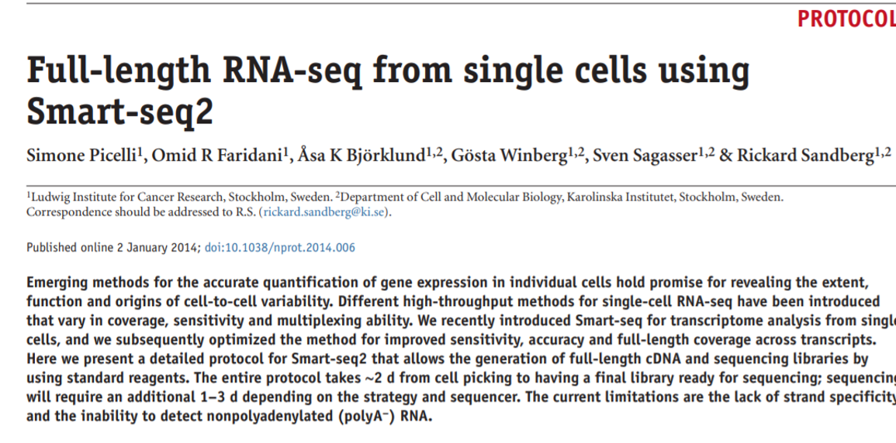
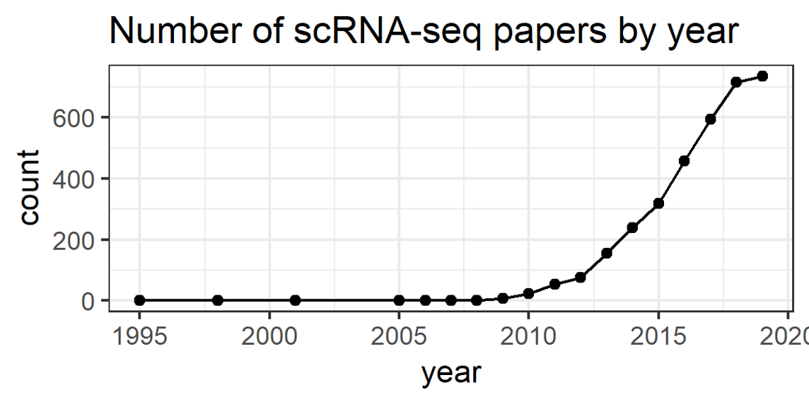
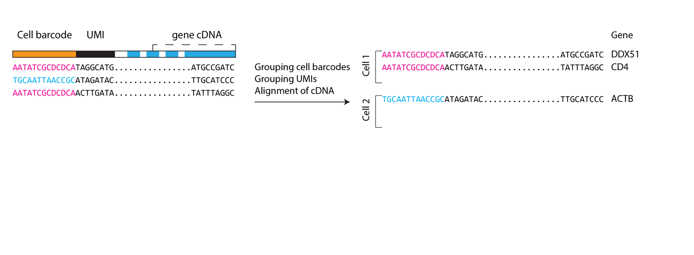
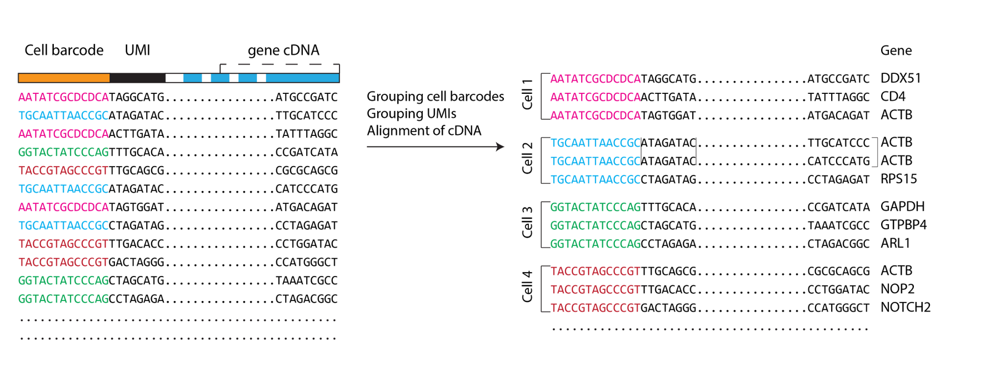
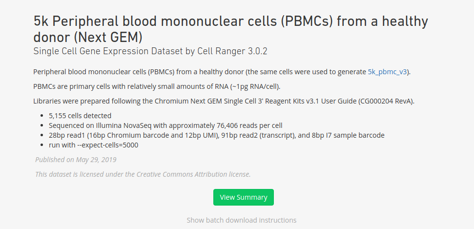
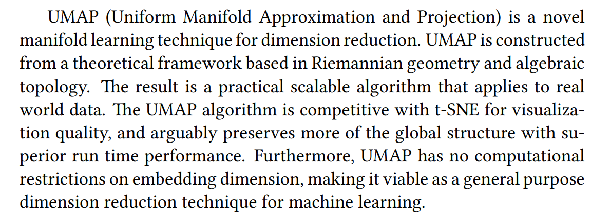

class: center, middle

# Секвенирование РНК одиночных клеток

---

## Клетка - фундаментальная единица

* Микроскопия
* Проточная цитометрия / FACS / CyTOF (Cytometry by Time Of Flight)
* scRNA-seq (секвенирование РНК одиночных клеток)
* Геномика и эпигенетика одиночных клеток
* Протеомика одиночных клеток

---

## Cеквенирование РНК одиночных клеток

.pull-left[.small[
* RNA-seq - снимок того, что происходит в образце
* Образец часто состоит из большого количества клеток, различных клеточных типов.
* Single-cell RNA-seq - тысячи индивидуальных снимков каждой клетки в образце, чтобы понять общую картину
]
]
.pull-right[
  .center[]
]

---

## Зачем использовать scRNA-seq


Гетерогенные образцы:
* Обнаружение новых клеточных типов
* Сравнение похожих клеточных типов
* Обнаружение маркеров для клеточных популяций

Гомогенные образцы:
* Что же отличается между похожими клетками?
* Клеточные состояния и клеточные процессы

Понимание траекторий клеточной дифференцировки

---

## Smart-seq2

.center[]

<div class="my-footer"><span>Статья: https://www.nature.com/articles/nprot.2014.006</span></div> 


---

## Single-cell RNA-seq миелоидных клеток

.pull-left[
* Villani, Satija et al
* Science, 2017
* 1152 cells
]

.pull-right[
.center[]
]


<div class="my-footer"><span>Статья: https://science.sciencemag.org/content/356/6335/eaah4573</span></div> 

---

## Single-cell RNA-seq миелоидных клеток

.center[]


<div class="my-footer"><span>Статья: https://science.sciencemag.org/content/356/6335/eaah4573</span></div> 


---

## Single-cell RNA-seq меланомы

.pull-left[
* Tirosh, Izar et al
* Science, 2016
* 4645 cells
]

.pull-right[

]

<div class="my-footer"><span>Статья: https://science.sciencemag.org/content/352/6282/189.long</span></div> 

---

## Drop-seq: Cell, 2015

.center[

]

<div class="my-footer"><span>Статья: https://www.cell.com/abstract/S0092-8674(15)00549-8</span></div> 

---

## 10x chromium machine: NComms, 2017

.center[

]

<div class="my-footer"><span>Статья: https://www.nature.com/articles/ncomms14049</span></div> 

---

## Seq-Well: NMeth, 2017

.pull-left[

]

.pull-right[

]

<div class="my-footer"><span>Статья: https://www.nature.com/articles/nmeth.4179</span></div> 

---

## Microwell-Seq: Cell, 2018

.center[

]

<div class="my-footer"><span>Статья: https://www.ncbi.nlm.nih.gov/pubmed/29474909</span></div> 

---

## Рост технологий scRNA-seq

.center[

]

<div class="my-footer"><span>Human cell atlas white paper: https://arxiv.org/pdf/1810.05192.pdf</span></div> 

---

## Рост технологий scRNA-seq

.center[

]

<div class="my-footer"><span>по результатам выдачи pubmed</span></div> 

---

## Основные проблемы

* **Как амплифицировать и секвенировать малое количество молекул РНК (типичная клетка млекопитающего содержит всего 200 000 молекул мРНК) **
* Как изолировать клетки
* Как работать с большим количеством клеток

---


## Низкое разнообразие библиотеки


* Малое количество молекул мРНК в клетке порождает проблему
* Молекулы кДНК будут амплифицированы ПЦР-ом
* ПЦР-дупликаты не дают нам представления о настоящем уровне экспрессии гена

.center[

]

---

## Template-switching PCR

.pull-left[
* Switching Mechanism At the 5' end of RNA Template (SMART)
* Robust for low input libraries
]

.pull-right[

]

---

## Drop-seq: схема

.center[

]

<div class="my-footer"><span>Статья: https://www.cell.com/abstract/S0092-8674(15)00549-8</span></div>
---

## Drop-seq: микрофлюидика

.pull-left[

]

.pull-right[

]

<div class="my-footer"><span>Статья: https://www.cell.com/abstract/S0092-8674(15)00549-8</span></div>

---

## Drop-seq: микрофлюидика

.center[

]

---

## Drop-seq: схема

.center[

]

<div class="my-footer"><span>Статья: https://www.cell.com/abstract/S0092-8674(15)00549-8</span></div>

---

## Баркодирование

.center[

]

---

## Баркодирование

.center[

]

---

## Баркодирование

.center[

]

---

## Баркодирование

.center[

]

---

## Drop-seq: схема

.center[

]

<div class="my-footer"><span>Статья: https://www.cell.com/abstract/S0092-8674(15)00549-8</span></div>

---

## Секвенирование

.center[

]
---

## Секвенирование

.center[

]
---

## Секвенирование

.center[

]
---

## Секвенирование

.center[

]
---

## Секвенирование

.center[

]
---

## Секвенирование

.center[

]
---

## Секвенирование

.center[

]
---

## Секвенирование

.center[

]

---

## Найдены решения проблем

* Малое количество РНК – template switching PCR
* Изоляция клеток – микрофлюидика
* Идентификация прочтений – клеточные баркоды
* Борьба с ПЦР-дупликатами – клеточные/UMI баркоды

---

## Найдены решения проблем

* Малое количество РНК – template switching PCR
* **Изоляция клеток – микрофлюидика (может меняться от технологии к технологии)**
* **Баркодирование с бусами оказалось достаточно эффективным и используется в той или иной форме почти в каждой технологии**

---

## Датасет на сегодня:

* https://support.10xgenomics.com/single-cell-gene-expression/datasets/3.0.2/5k_pbmc_v3_nextgem

.center[

]

---

## Отчёт по качеству

* http://cf.10xgenomics.com/samples/cell-exp/3.0.2/5k_pbmc_v3_nextgem/5k_pbmc_v3_nextgem_web_summary.html

---

## Откуда приходит шум

.center[

]

---

## Откуда приходит шум

В растворе, который пойдет на вход машине все равно будет свободная РНК вне клеток, которую захватят бусы с баркодами. Нам необходимо отличать капли с клетками от пустых капель.

* Можно просто установить строгий порог по количеству UMI, ниже которого - шум
* Можно подсчитать "как выглядит шум" и различать между шумом и плохо покрытыми клетками (emptyDrops, https://genomebiology.biomedcentral.com/articles/10.1186/s13059-019-1662-y)

---

## Базовые шаги анализа scRNA-seq

* Фильтрация плохих баркодов
* Нормализация уровней экспрессии
* PCA
* Визуализация (tSNE/UMAP)
* Кластеризация
* Аннотация клеточных типов

---

## Загружаем библиотеки

```{r message=F, warning=F}
if (!requireNamespace("Seurat", quietly = TRUE)) install.packages("Seurat")
if (!requireNamespace("ggplot2", quietly = TRUE)) install.packages("ggplot2")
if (!requireNamespace("MAST", quietly = TRUE)) BiocManager::install("MAST")
if (!requireNamespace("dplyr", quietly = TRUE)) install.packages("dplyr")
if (!requireNamespace("Matrix", quietly = TRUE)) install.packages("Matrix")

library(Seurat)
library(MAST)
library(ggplot2)
library(dplyr)
library(Matrix)
```

---

## Загружаем данные

```{r }

data <- Read10X("filtered_feature_bc_matrix/")
dim(data)

```

Матрица каунтов - огромная:

* 33538 генов 
* 5155 клеток


---

## Распределение UMI

```{r fig.height=3, fig.fullwidth=T, dev='svg', message=F}

plotData <- data.frame(
  umis <- colSums(data)
)
ggplot(data=plotData, aes(x=umis)) +
  geom_histogram() + theme_bw()

```

---

## Фильтрация (генов и баркодов)

```{r }

seurat <- CreateSeuratObject(data, min.cells = 10, min.features = 10)
dim(seurat)

```

17527 из 33538 генов были отфильтрованы (задетектированы в $\leq 10$ клеток)

---

## Фильтрация (генов и баркодов)

```{r fig.height=3, fig.width=4.5, dev='png', message=F, fig.show='hold', dpi=100}
seurat[["percent.mt"]] <- PercentageFeatureSet(seurat, pattern = "^MT-")
FeatureScatter(seurat, "nCount_RNA", "nFeature_RNA") + scale_x_log10() + scale_y_log10()
```

---

## Фильтрация (генов и баркодов)

```{r fig.height=3, fig.width=4.5, dev='png', message=F, fig.show='hold', dpi=100}
FeatureScatter(seurat, "nCount_RNA", "percent.mt") + scale_x_log10()
FeatureScatter(seurat, "nFeature_RNA", "percent.mt") + scale_x_log10()
```

---

## Фильтрация (генов и баркодов)

```{r message=F, warning=F}
seurat <- subset(seurat, subset = nFeature_RNA > 300 & percent.mt < 25)
dim(seurat)
```

---

## Нормализация (старый способ)

```{r }

## seurat <- NormalizeData(seurat, normalization.method = "LogNormalize", scale.factor = 10000)
## seurat <- FindVariableFeatures(seurat, selection.method = "vst", nfeatures = 2000)
## seurat <- ScaleData(seurat)

```

* Масштабируем экспрессию до 10 000 UMI в каждой клетке
* Находим гены с высокой вариацией (гены выше mean/variance trend)
* Расчитывает стандартизированную оценку для каждого гена (z-score, Z-оценка, нужно для PCA)

---

## Нормализация (новый способ)

```{r message=F, warning=F, cache=T}
seurat <- SCTransform(seurat, vars.to.regress = "percent.mt", verbose = FALSE)

```

* SCTransform делает всё это в одной команде (и делает это даже лучше)

---

## SCTransform: 

.center[

]

<div class="my-footer"><span>Статья: https://www.biorxiv.org/content/biorxiv/early/2019/03/18/576827.full.pdf </span></div>

---

## Базовые шаги анализа scRNA-seq

* Фильтрация плохих баркодов
* Нормализация уровней экспрессии
* **PCA (метод главных компонент)**
* Визуализация (tSNE/UMAP)
* Кластеризация
* Аннотация клеточных типов

---

## Высокая размерность данных scRNA-seq

.small[
Изначальная матрица очень большого размера, и это создает различные проблемы:

* Алгоритмы работают медленнее с данными большой размерности
* Проклятие размерности


Обычно мы предпринимаем несколько шагов понижения размерности, прежде чем создать двумерную картинку того, как выглядит наш датасет:

* Оставляем только вариабельные гены
* Понижаем размерность с помощью PCA до 20-30 компонент
]


---

## PCA

```{r fig.height=3, fig.width=6, dev='svg', message=F, fig.show='hold'}
seurat <- RunPCA(seurat, verbose = FALSE)
ElbowPlot(seurat, ndims = 50)
```

---

## Базовые шаги анализа scRNA-seq

* Фильтрация плохих баркодов
* Нормализация уровней экспрессии
* PCA (метод главных компонент)
* **Визуализация (tSNE/UMAP)**
* Кластеризация
* Аннотация клеточных типов


---

## Визуализация
.small[
Алгоритмы tSNE и UMAP уложат наши данные после PCA в двумерную плоскость:

* Точки, которые близко друг к другу - клетки, которые транскрипционно похожи
* Точки, которые далеко друг от друга - клетки, которые транскрипционно отличаются

Размерность каждой клетки:
* Только вариабельные гены: 30k+ -> 2-3k вариабельных генов
* PCA: 2-3k вариабельных генов -> 20-30 главных компонент
* tSNE/UMAP: 20-30 главных компонент -> 2d или 3d
]
---

## tSNE

```{r fig.height=3, fig.width=4.5, dev='png', message=F, warning=F, fig.show='hold', dpi=100}
seurat <- RunTSNE(seurat, dims=1:20)
DimPlot(seurat, reduction = "tsne") + NoLegend()
```

<div class="my-footer"><span> Статья: http://www.jmlr.org/papers/volume9/vandermaaten08a/vandermaaten08a.pdf </span></div>

---

## tSNE
.small[
tSNE - Стохастическое вложение соседей с t-распределением ("t-Distributed Stochastic Neighbor Embedding") - техника понижения размерности для визулизации многомерных данных.

* В оригинальном пространстве рассчитываются расстояния между точками, а затем условные вероятности $p_{i| j}$, что точка $i$ выберет точку $j$ в качестве соседа. $p_{i| j}$  пропорциональны дистанциям от $i$ до других точек (вообще говоря, плотности вероятности вокруг точки $i$, но здесь это неважно).
* Когда все $p_{i, j}$ посчитаны в оригинальном пространстве, мы пытаемся найти 2d/3d укладку, у которой будет похожее распределение вероятностей
]

<div class="my-footer"><span>Статья: http://www.jmlr.org/papers/volume9/vandermaaten08a/vandermaaten08a.pdf </span></div>

---

## UMAP

```{r fig.height=3, fig.width=4, dev='png', message=F, warning=F, fig.show='hold', dpi=120}
seurat <- RunUMAP(seurat, dims=1:20)
DimPlot(seurat, reduction = "umap") + NoLegend()
```

<div class="my-footer"><span>Статья: https://arxiv.org/pdf/1802.03426.pdf </span></div>

---

## UMAP

.center[

]

<div class="my-footer"><span>Статья: https://arxiv.org/pdf/1802.03426.pdf </span></div>

---

## UMAP

https://pair-code.github.io/understanding-umap/

---

## Сравним

```{r fig.height=3, fig.width=3, dev='png', message=F, fig.show='hold', dpi=120}
DimPlot(seurat, reduction = "tsne") + NoLegend()
DimPlot(seurat, reduction = "umap") + NoLegend()
```

---

## Базовые шаги анализа scRNA-seq

* Фильтрация плохих баркодов
* Нормализация уровней экспрессии
* PCA
* Визуализация (tSNE/UMAP)
* **Кластеризация**
* Аннотация клеточных типов

---

## Кластеризация и аннотация

Кластеризация:
* Графовая кластеризация (предпочтительнее)
* K-means 

Аннотация:
* Сначала известные маркеры
* Для кластера запустить дифференциальную экспрессию: кластер против всех остальных
* Топ дифференциально экспрессированных генов - хорошие маркеры для кластера

---

## Кластеризация

.pull-left[

* Вместо того, чтобы смотреть на кластеры просто по расстоянию, мы сначала найдем общих ближайших соседей
* Клетки, у которых много общих соседей, вероятно живут в "одном районе"
* Алгоритмы пытаются найти такие соседства
]

.pull-right[
  .center[]
]

<div class="my-footer"><span>Статья: https://academic.oup.com/bioinformatics/article/31/12/1974/214505 </span></div>

---

## Кластеризация

```{r fig.height=2.6, fig.width=2.6, dev='png', message=F, warning=F, fig.show='hold', dpi=120}
seurat <- FindNeighbors(seurat, dims = 1:20, verbose = FALSE)
seurat <- FindClusters(seurat, resolution=0.6, verbose = FALSE)
DimPlot(seurat, reduction = "tsne", label = TRUE) + NoLegend()
DimPlot(seurat, reduction = "umap", label = TRUE) + NoLegend()
```

---

## Аннотация
.small[
CD14, CD79A, CD3D - известные маркеры моноцитов, б-клеток и т-клеток соотвественно
]
```{r fig.height=2.4, fig.width=8, dev='png', message=F, warning=F, fig.show='hold', dpi=120}
FeaturePlot(seurat, c("CD14", "CD79A", "CD3D"), cols=c("grey", "red"), reduction="umap", ncol=3)
```

---

## Аннотация

МЫ можем запустить тест дифференциальной экспрессии, чтобы автоматически найти маркеры (используя MAST-test)

```{r fig.height=2.4, fig.width=6, dev='png', message=F, warning=F, fig.show='hold', dpi=120, cache=T}
# max cells per ident was set to speed up the whole thing
allMarkers <- FindAllMarkers(seurat, max.cells.per.ident = 100, test.use = "MAST", only.pos = T)
goodMarkers <- allMarkers %>% group_by(cluster) %>% top_n(n = 1, wt = avg_logFC) %>% pull(gene)
goodMarkers
```

---

## Способы показать экспрессию
.small[
Есть несколько способов показывать экспрессию, один из них - показать экспрессию поверх графика понижения размерности.
]
```{r fig.height=2.4, fig.width=8, dev='png', message=F, warning=F, fig.show='hold', dpi=120}
FeaturePlot(seurat, goodMarkers[1:3], cols=c("grey", "red"), reduction="umap", ncol=3)
```

---

## Способы показать экспрессию

второй способ - Violin plot 

```{r fig.height=2.4, fig.width=8, dev='png', message=F, warning=F, fig.show='hold', dpi=120}
VlnPlot(seurat, goodMarkers[1:3], pt.size = 0.1)
```

---

## Коммуникация важна


* Когда кластеры найдены, нужно понять какие клетки находятся в кластере, кластеры нужно "аннотировать"
* Если вы биоинформатик, и вы анализируете датасет, который вам прислали - это идеальное время, чтобы пойти и поговорить с биологом, который ставил этот эксперимент
* Если вы биолог, и вы поставили этот сингл-селл эксперимент, есть вероятность, что вы знаете все нужные вам маркеры для аннотации (вероятно вы знаете их лучше гугла)
* Аннотация и последующий анализ - та часть, где коммуникация важнее всего

---

## Latest things: 5'

* 5’ scRNA-seq is different from 3’ scRNA-seq
* 5’ scRNA-seq allows us to get TCR and IG repertoires of the cell

---

## 3' sequencing

.center[]

---

## 5' sequencing

.center[]

---

## Surface protein expression

.center[]
.center[]

---

## Surface protein expression

.center[]

---

## Вопросы?


