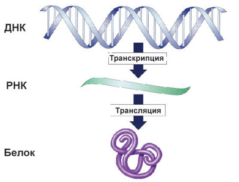
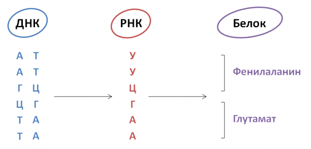

class: center, middle

# Биоинформатика

---

## Биоинформатика

.pull-left[.small[
* Биоинформатика - междисциплинарная область, которая разрабатывает алгоритмы и программы для понимания биологических данных  

* Биоинформатика сочетает в себе биологию, математику, статистику, информатику для анализа и интерпретации биологических данных
]
]
.pull-right[
  .center[]
]

---

## Биология везде

* Биология
* Медицина / эпидемиология 
* Генная инженерия 
* Сельское хозяйство
* Криминалистика
* История

---

## Биоинформатика - значит сейчас

* Знания и технологии в биологии постоянно
изменяются
* И даже прямо сейчас
* Там где есть большие технологии и большие данные всегда найдут своё место математика и алгоритмы

--
* Откуда берутся большие данные?

---

## Проект "Геном Человека"

.pull-left[
* Начат в 1990 году
* Черновик структуры генома – 2000 год
* Собран геном "целиком" – 2003 год
]
.pull-right[
  .center[]
]

---

## Цена секвенирования быстро падает

.center[]

---

## Основная догма молекулярной биологии

.center[]

---

## Геном по-простому

* ДНК – (две спирали) последовательность из
4 возможных символов: A, T, G и С
* Геном – последовательность всей ДНК
человека
* Ген – участок генома
* Человеческий геном содержит примерно 3
миллиарда пар оснований (символов)
* РНК – одна цепь, вместо T используем U
* Каждые три символа РНК кодируют одну
аминокислоту
* Белок – последовательность аминокислот

---

## Геном по-простому

.center[]

---

## Основная догма молекулярной биологии

.center[]

---

## Секвенирование и сборка

.pull-left[.small[
* Секвенирование - процесс "прочтения" молекулы ДНК, восстановление последовательности. Получение набора нуклеотидов из физической молекулы 

* Чаще всего прочитанные фрагменты - части одной большей молекулы. Восстановление всей молекулы - это сборка
]

]
.pull-right[
  .center[]
]

---

## Граф Де Брюина

Предположим, что у нас есть молекула большая молекула:

ATAGACCCTAGACGAT

Разобьем граф на k-меры, где $k=4$. k-меры - это все подстроки длины k: ATAG, TAGA, AGAC, GACC, ACCC, CCCT, CCTA, CTAG, TAGA, AGAC, GACG, ACGA, CGAT.

k-меры - это вершины графа. Для того, что провести ребра в графе, посмотрим на все подстроки длины $L = k + 1 = 5$. В каждой такой подстроке есть два k-мера - мы проводим из левого k-мера, в правый k-мер.

---

## Граф Де Брюина

Для строки ATAGACCCTAGACGAT

.center[]

---

## Граф Де Брюина

Тогда искомая молекула это путь в графе по всем вершинам!

.center[]

---

## Сборка по Графу Де Брюина

Прочтения (длины 8) - результаты секвенирования:  
ATAGACCC  
GACCCTAG  
CCTAGACG  
TAGACGAT  

Используем k-меры длины 4

Какая была искомая молекула?

--

Графы Де Брюина для целой молекулы и для прочтений будут совпадать!

---

## Сборка по Графу Де Брюина

.pull-left[
Прочтения (длины 8):  
ATAGACCC  
GACCCTAG  
CCTAGACG  
TAGACGAT 
]
.pull-right[
  .center[]
]

--

Искомая молекула - это путь в графе ATAGACCCTAGACGAT !

---

## Сборка по Графу Де Брюина

В реальной жизни, конечно, всё заметно сложнее и больше!

Длина искомой молекулы - сотни миллионов нуклеотидов.

Длина прочтений - ~100-200 нуклеотидов (в случае коротких прочтений).

Сотни миллионов прочтений!

Используемые k-меры - длины от 30 до 70.

Какая была искомая молекула?

---

## Сборка генома

* Сборка человеческого генома была бы невозможна без алгоритмической составляющей
* Собранный геном позволил нам понять, сколько вообще генов есть в геноме,
какие там бывают вариации, а затем (собрав ещё больше данных) начать связывать мутации в геноме с генетическими заболеваниями

---

## Основная догма молекулярной биологии

.center[]

---

## Секвенирование РНК одиночных клеток

.center[]

---

## Секвенирование РНК одиночных клеток

.center[]

---

## Секвенирование РНК одиночных клеток

.pull-left[.small[
* Результат секвенирования РНК одиночных клеток - огромная таблица
* Колонки этой матрицы - это клетки, десятки-сотни тысяч
* Строки этой матрицы - это гены, в человеке ~25 000
* Сколько молекул РНК гена нашлось в клетке?
* Как вообще интерпретировать такие результаты?
]]
.pull-right[
  .center[]
]

---

## Методы машинного обучения

.pull-left[
* Методы понижения размерности (tSNE / UMAP): превратить многомерную матрицу в двухмерную картинку
* Методы кластеризации (алгоритмы основанные на графах): обнаруживать клеточные популяции
]
.pull-right[
  .center[]
]

Взято из статьи https://nn.neurology.org/content/nnn/7/4/e732.full.pdf
 

---

## Методы машинного обучения

* Методы машинного обучения сильно упрощают интерпретацию данных
* Только когда есть возможность интерпретации - мы можем начинать делать какие-либо биологические выводы

---

## Основная догма молекулярной биологии

.center[]

---

## Молекулярный докинг

* Молекулярный докинг - подобласть молекулярного моделирования
* Докинг - это метод, который предсказывает предпочтительную ориентацию одной молекулы относительно второй, когда они связаны друг с другом с образованием стабильного комплекса.

---

## Молекулярный докинг

.center[]

Взято из https://en.wikipedia.org/wiki/Docking_(molecular)
 

---

## Молекулярный докинг

.center[]

---

## Молекулярный докинг

* Автоматический поиск кандидатов для новых медикаментов:
* Если вы знаете, что один препарат работает за счёт связывания с одним рецептором, вы можете перебрать кучу разных молекул и проверить (вычислительно) связываются ли они с этим же рецептором
* Если ваше моделирование предсказало связывание - вы можете протестировать эту молекулу и рецептор в лаборатории

---

## Биоинформатика

* Огромное поле с большим количеством различных задач
* Кроме науки, есть и компании, использующие биоинформатические подходы

---

## Как попасть в биоинформатику?

Обычные пути:
* Получить образование в статистике\прикладной математике\информатике и выбрать диплом связанный с биоинформатикой
* Получить образование в биологии\генной инженерии\биотехнологии и выбрать диплом, где нужно использовать биоинформатические программы

---

## Как попасть в биоинформатику?

Прямые пути:
* МГУ ФББ (Факультет биоинженерии и биоинформатики, специалитет)
* ВШЭ ФКН (факультет компьютерных наук, майнор трек - биоинформатика)
* ИТМО, магистратура "**биоинформатика и системная биология**"
* ВШЭ, магиструтура "анализ данных в биологии и медицине"
* **Институт биоинформатики** - дополнительное образование (https://bioinf.me/)

---

class: center, middle

# Есть ли у вас вопросы?

