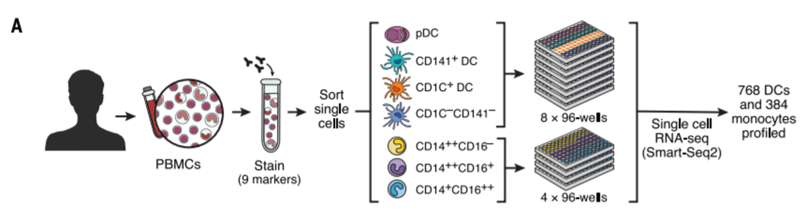
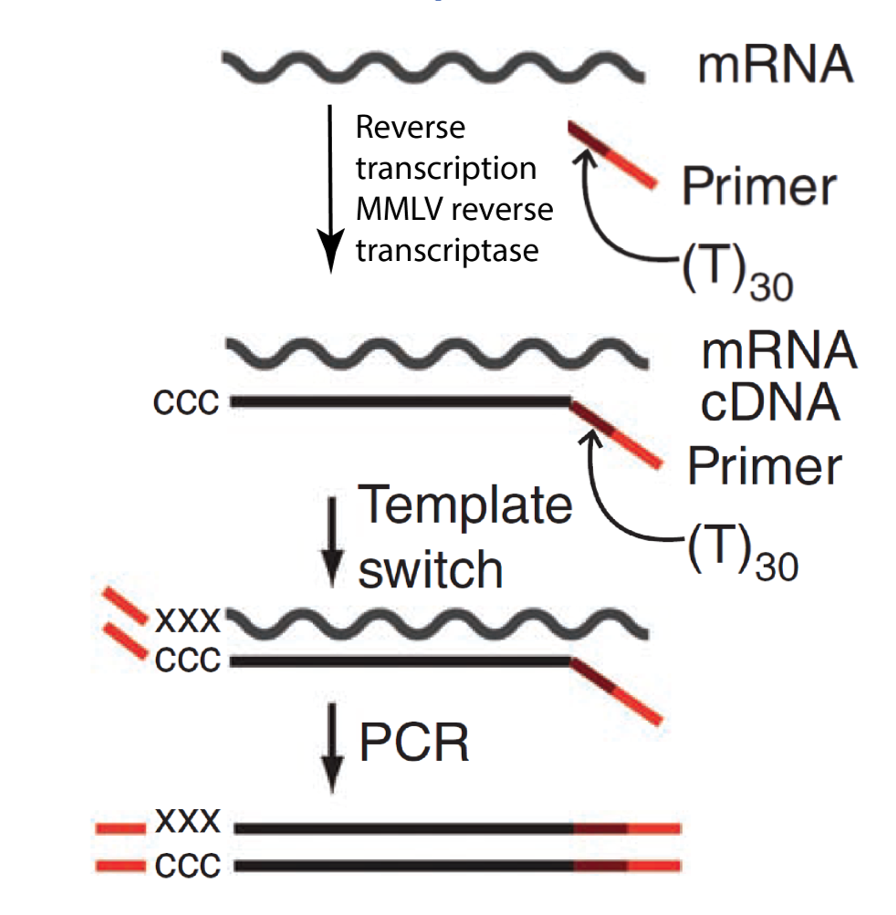
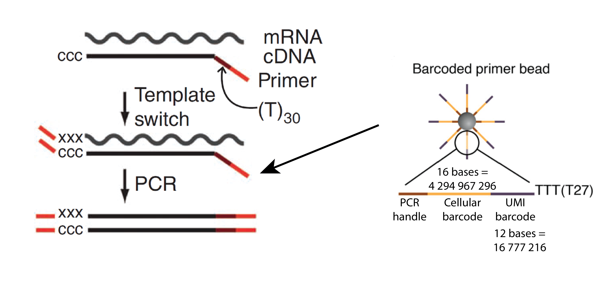
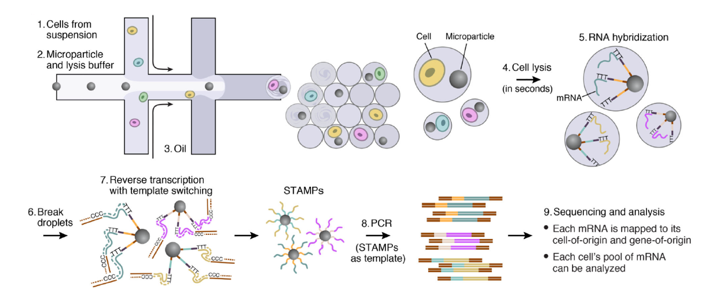
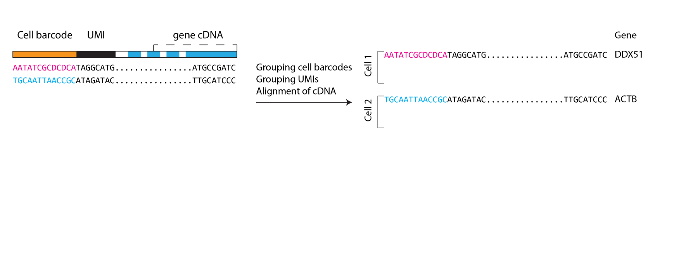
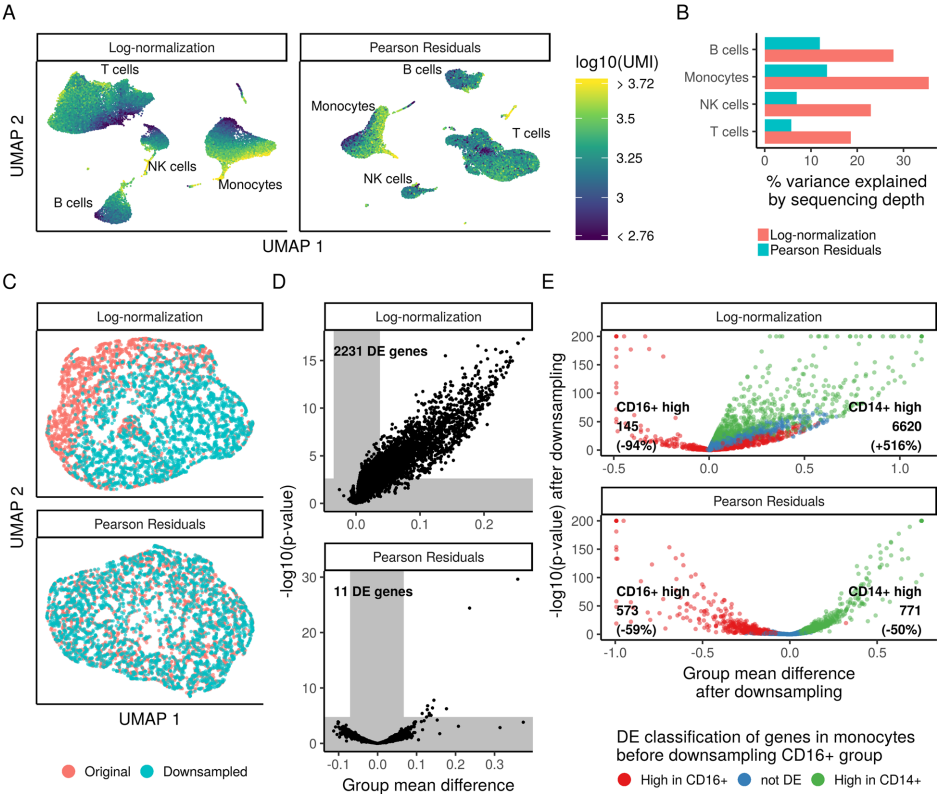

class: center, middle

# Single-cell RNA-seq (scRNA-seq)

---

## Cell is the fundamental unit

* Microscopy
* FACS (fluorescence activated cell sorting)/ CyTOF (Cytometry by Time Of Flight)
* scRNA-seq (single-cell RNA-seq)
* Single cell genomics and epigenetics

---

## Single cell RNA-seq

.pull-left[
* RNA-seq is a snapshot of what is happening in the sample
* Sample consistss of many different cells and cell types
* Single-cell RNA-seq - thousand of individual snapshots of many cells to capture the whole picture
]
.pull-right[
  .center[]
]

---

## Why single-cell RNA-seq

Heterogenous populations:
* New cell subpopulations discovery
* Comparison of similar cell subpopulations
* Marker selection for cell subpopulations

Homogenous populations:
* Understanding heterogeneity
* Cellular states and cellular processes

Tracking of cell differentiation

---

## Smart-seq2

.center[]

Paper: https://www.nature.com/articles/nprot.2014.006
 

---

## Single-cell RNA-seq of myeloid cells

.pull-left[
* Villani, Satija et al
* Science, 2017
* 1152 cells
]

.pull-right[
.center[]
]

Paper: https://science.sciencemag.org/content/356/6335/eaah4573
 

---

## Single-cell RNA-seq of myeloid cells

.center[]

Paper: https://science.sciencemag.org/content/356/6335/eaah4573
 

---

## Single-cell RNA-seq of melanoma

.pull-left[
* Tirosh, Izar et al
* Science, 2016
* 4645 cells
]

.pull-right[

]

Paper: https://science.sciencemag.org/content/352/6282/189.long
 

---

## Drop-seq: Cell, 2015

.center[

]

Paper: https://www.cell.com/abstract/S0092-8674(15)00549-8
 

---

## 10x chromium machine: NComms, 2017

.center[

]

Paper: https://www.nature.com/articles/ncomms14049
 

---

## Seq-Well: NMeth, 2017

.pull-left[

]

.pull-right[

]

Paper: https://www.nature.com/articles/nmeth.4179
 

---

## Microwell-Seq: Cell, 2018

.center[

]

Paper: https://www.ncbi.nlm.nih.gov/pubmed/29474909
 

---

## Growth of single-cell technologies

.center[

]

Human cell atlas white paper: https://arxiv.org/pdf/1810.05192.pdf
 

---

## Growth of single-cell technologies

.center[

]

Based on pubmed results
 

---

## Main challenges

* **How to amplify and sequence small number of RNA (typical mammalian cell has only 200 000 mRNA molecules)?**
* How to isolate cells?
* How to work with big number of cells?

---

## Low library complexity

* Small numbers of mRNA molecules yield low complexity cDNA library
* cDNA molecules to be amplified by PCR
* We don’t want to sequence tons of PCR duplicates

.center[

]

---

## Template-switching PCR

.pull-left[
* Switching Mechanism At the 5' end of RNA Template (SMART)
* Robust for low input libraries
]

.pull-right[

]

---

## Drop-seq schematics

.center[

]

Paper: https://www.cell.com/abstract/S0092-8674(15)00549-8

---

## Drop-seq microfluidics

.pull-left[

]

.pull-right[

]

Paper: https://www.cell.com/abstract/S0092-8674(15)00549-8

---

## Drop-seq microfluidics

.center[

]

---

## Drop-seq schematics

.center[

]

Paper: https://www.cell.com/abstract/S0092-8674(15)00549-8

---

## Barcoding

.center[

]

---

## Barcoding

.center[

]

---

## Barcoding

.center[

]

---

## Barcoding

.center[

]

---

## Drop-seq schematics

.center[

]

Paper: https://www.cell.com/abstract/S0092-8674(15)00549-8

---

## Sequencing

.center[

]
---

## Sequencing

.center[

]
---

## Sequencing

.center[

]
---

## Sequencing

.center[

]
---

## Sequencing

.center[

]
---

## Sequencing

.center[

]
---

## Sequencing

.center[

]
---

## Sequencing

.center[

]

---

## All questions were addressed

* Low input mRNA – template switching PCR
* Cell isolation – microfluidics
* Read identification – Cell barcodes
* Dealing with PCR duplicates – Cell/UMI barcodes

---

## All questions were addressed

* Low input mRNA – template switching PCR
* **Cell isolation – microfluidics (might vary from technology to technology)**
* **Barcoding with beads proved to be very effective**

---

## Dataset for today:

* https://support.10xgenomics.com/single-cell-gene-expression/datasets/3.0.2/5k_pbmc_v3_nextgem

.center[

]

---

## Let's have a loot at the summary

* http://cf.10xgenomics.com/samples/cell-exp/3.0.2/5k_pbmc_v3_nextgem/5k_pbmc_v3_nextgem_web_summary.html

---

## Understaing what's noise

.center[

]

---

## Understaing what's noise

There is cell-free RNA in the cellular suspension that will be captured in empty droplets (with beads), and we must distinguish cells from empty droplets:

* We can set a hard threshold on UMI to filter noise from actual cells
* We can calculate noise signature and test every cell against this signature (emptyDrops, https://genomebiology.biomedcentral.com/articles/10.1186/s13059-019-1662-y)

---

## SCN: single-cell navigator

* In our lab we develop tools to visualize single-cell expression data
* scNavigator currently has many public datasets (and will have even more)
* For now we only need our "toy" dataset, follow the link below

https://artyomovlab.wustl.edu/scn/?token=10x_5k_pbmc

---

## Basic steps to analysis of scRNA-seq

* Filtering out “bad” barcodes
* Normalizing expression levels: (scaling and log2 normalizing)
* PCA
* Visualization (tSNE or UMAP)
* Clustering
* Cellular subset annotation

---

## What is count matrix

Count matrix is large:

* 33538 genes 
* 5155 cells

---

## Normalization (old way)

* Scaling expression to 10 000 UMIs (instead of million in RPM)
* Finding features with high variance (features above mean/variance trend)
* Scaling data (for PCA and so on)

---
## SCTransform: 

.center[

]

Paper: https://genomebiology.biomedcentral.com/track/pdf/10.1186/s13059-019-1874-1 

---
## SCTransform: 

.center[

]

Paper: https://genomebiology.biomedcentral.com/track/pdf/10.1186/s13059-019-1874-1 

---

## Basic steps to analysis of scRNA-seq

* Filtering out “bad” barcodes
* Normalizing expression levels: (scaling and log2 normalizing)
* **PCA**
* Visualization (tSNE or UMAP)
* Clustering
* Cellular subset annotation

---
## High-dimensionality of scRNA-seq

Initially matrix is very large in size, this causes different kind of issues:

* Some algorithms are just slow when performed in this high-dimensionality data
* Curse of dimensionality

We usually take several steps to reduce dims before creating 2d clustered map of our dataset

* Keeping only variable genes (since those introduce variance to the dataset)
* PCA will reduce dimensionality to 20-30 first components

---

## Basic steps to analysis of scRNA-seq

* Filtering out “bad” barcodes
* Normalizing expression levels: (scaling and log2 normalizing)
* PCA
* **Visualization (tSNE or UMAP)**
* Clustering
* Cellular subset annotation

---

## Visualization

Both tSNE and UMAP will put our data after PCA into a 2D plane:
* Dots that are close to each other are cells that are transcriptionally similar to each other
* Dots that are far from each other are cells that are trasncriptionally diffirent from each other

Lets look at dimensionality of each cell:
* Variable genes only: 30k+ -> 2-3k of variable genes
* PCA: 2-3k of variable genes -> 20-30 principal components
* tSNE or UMAP: 20-30 PCs -> 2d or 3d plots

---

## tSNE

tSNE - "t-Distributed Stochastic Neighbor Embedding (t-SNE) is a technique for dimensionality reduction that is particularly well suited for the visualization of high-dimensional datasets"

* We can calculate distances in original space, and then calculate conditional probabilities $p_{i| j}$ that point $i$ would choose point $j$ as a neighbor. $p_{i| j}$  are proportional to "distances" from $i$ to all other points (actually probability density around point $i$, but it doesn't matter here).
* Once all $p_{i, j}$ are calculated in original space we try to find such 2d/3d space that would have similar probabilities

Paper: http://www.jmlr.org/papers/volume9/vandermaaten08a/vandermaaten08a.pdf 

---

## UMAP

.center[

]

Paper: https://arxiv.org/pdf/1802.03426.pdf 

---

## UMAP

https://pair-code.github.io/understanding-umap/

---

## Basic steps to analysis of scRNA-seq

* Filtering out “bad” barcodes
* Normalizing expression levels: (scaling and log2 normalizing)
* PCA
* Visualization (tSNE or UMAP)
* **Clustering**
* Cellular subset annotation

---

## Clustering and annotation

Clustering:
* Graph-based clustering (preferred)
* K-means 

Annotation:
* First, check known markers
* For each cluster, perform differential expression: cluster against all others
* Top DE genes exprected to be highly distinctive marker genes

---

## Clustering

.pull-left[
* Instead of defining clusters based on distance we first find “shared nearest neighbors"
* Cells that have a lot of neighbors in common, most likely “live in the same neighborhood”
* Algorithm is trying to find such neighborhoods
]

.pull-right[
  .center[]
]

Paper: https://academic.oup.com/bioinformatics/article/31/12/1974/214505 

---

## Annotation

Known markers: CD14, CD79A, CD3D are known markers of Monocytes, B cells and T cells respectively

---
## Communication is important

* When clusters are found we want to identify which cell subsets are presented, to “annotate” them
* If you are a bioinformatician and you are a single-cell RNA-seq dataset that have been designed/done by you, this is a perfect to time to go and talk to a biologist who performed/designed the experiment
* If you are a biologist who designed/performed single-cell RNA-seq experiment, chances are, you know all cellular subsets and markers better than almost anyone else
* This is where you communicate and try to make sense of the data

---

## Questions?

