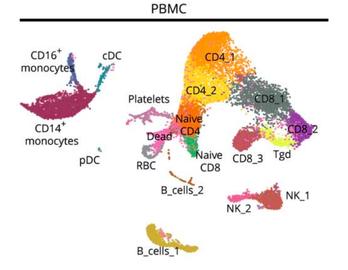
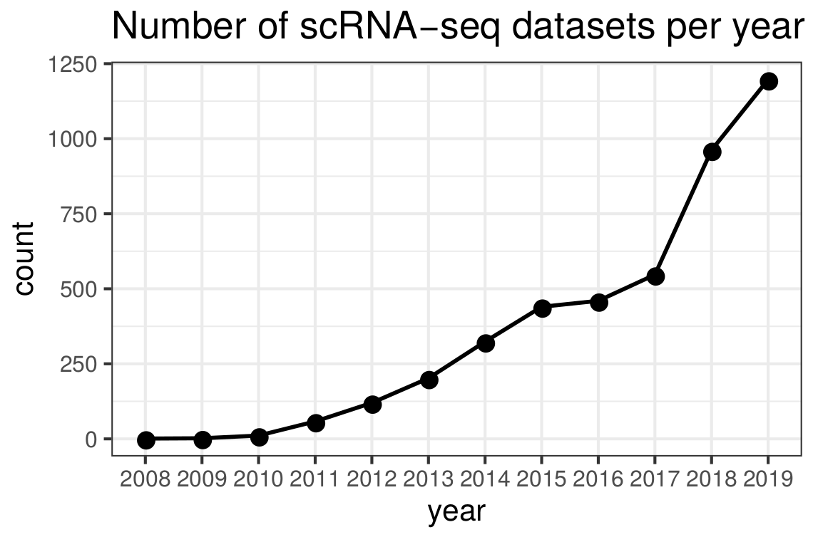
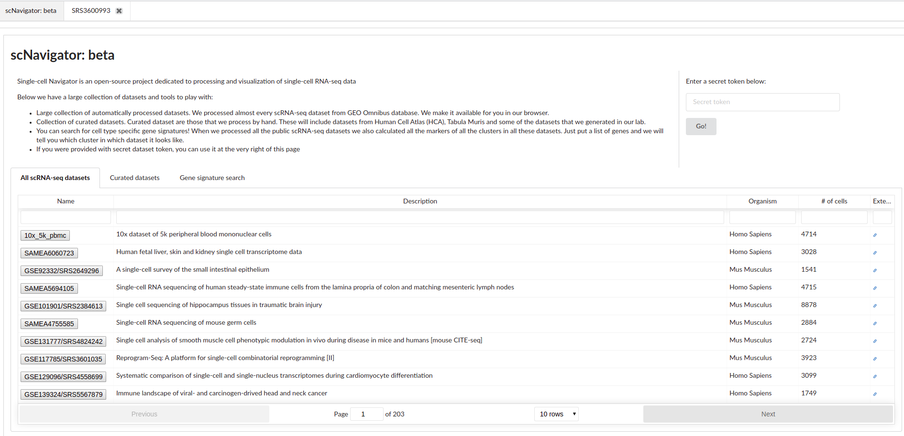
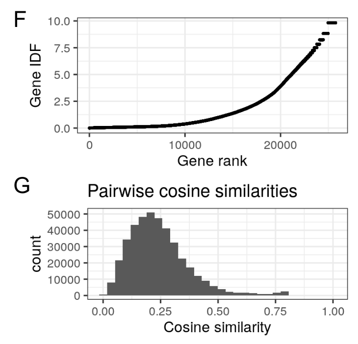
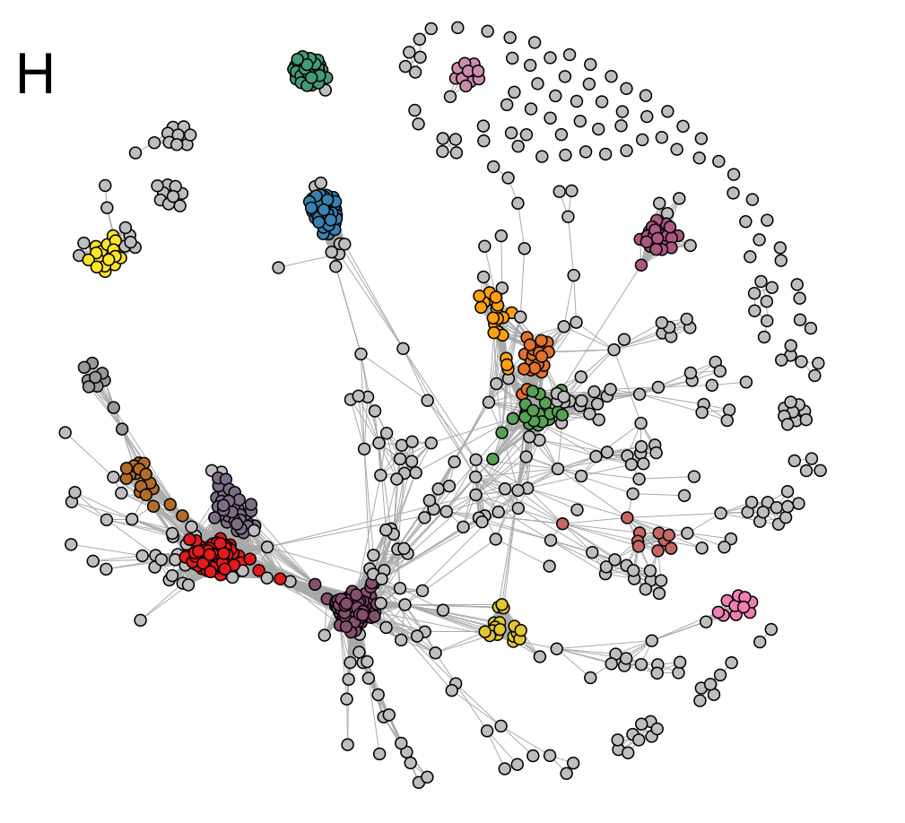
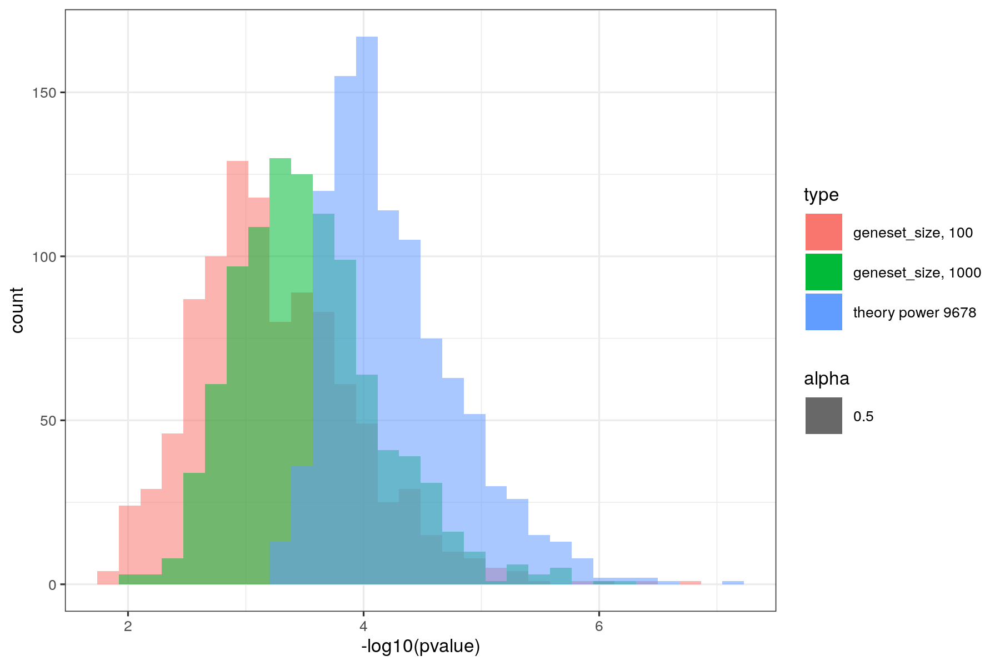

class: center, middle

# Quick intro to scRNA-seq

---

## Cell is the fundamental unit

* Microscopy
* FACS (fluorescence activated cell sorting)
* CyTOF (Cytometry by Time Of Flight)
* scRNA-seq (single-cell RNA-seq)
* Single cell genomics and epigenetics
---

## Single cell RNA-seq

.pull-left[
* RNA-seq is a snapshot of what is happening in the sample
* Sample consistss of many different cells and cell types
* Single-cell RNA-seq - thousand of individual snapshots of many cells to capture the whole picture
]
.pull-right[
  .center[]
]

---

## Why single-cell RNA-seq


Heterogenous populations:
* New cell subpopulations discovery
* Comparison of similar cell subpopulations
* Marker selection for cell subpopulations

Homogenous populations:
* Understanding heterogeneity
* Cellular states and cellular processes

Tracking of cell differentiation

---

## Growth of single-cell technologies

.center[

]

<div class="my-footer"><span>Human cell atlas white paper: https://arxiv.org/pdf/1810.05192.pdf</span></div> 

---

## Growth of single-cell technologies

.center[

]

<div class="my-footer"><span>Based on pubmed results</span></div> 

---

## Drop-seq schematics

.center[

]

<div class="my-footer"><span>Paper: https://www.cell.com/abstract/S0092-8674(15)00549-8</span></div>

---

## Barcoding

.center[

]

---

## Drop-seq schematics

.center[

]

<div class="my-footer"><span>Paper: https://www.cell.com/abstract/S0092-8674(15)00549-8</span></div>

---
## Sequencing

.center[

]
---

## Sequencing

.center[

]

---

## Creating a map of the dataset

.center[

]

<div class="my-footer"><span>Paper: https://nn.neurology.org/content/nnn/7/4/e732.full.pdf</span></div>
---

class: center, middle

# scNavigator

---

## Working with public datasets can be easy

https://artyomovlab.wustl.edu/scn/

* Initially we created scNavigator (back in the days single-cell explorer) to make life a bit easier
* Remove a person between a biologists and their data
* We wanted to be able to visualize and easily interpet scRNA-seq data


---

## scNavigator today

* Visualization web browser
* Large database of processed scRNA-seq datasets (kudos to Masha Firuleva)
* Signature search

---

## scNavigator today

* **Visualization web browser**
* Large database of processed scRNA-seq datasets (kudos to Masha Firuleva)
* Signature search

---

## scNavigator: visualization

Link to play with

https://artyomovlab.wustl.edu/scn/?token=10x_5k_pbmc

* Clustering, dim reductions, scatter plots
* Plots to show expressions (scatter plots and violin plots)
* Plots to show summarized pathway expression
* Markers tab: very easy way to check out markers and visualize their expression
* Filtering: you can only work with the cells you want to

---

## scNavigator features

* It is in **web**, you can send link with the dataset to your collaborators
* Most of the plotting done in the client (which means we can have many users accessing data in the same time)
* Web means we can cache the data that requested often
* It is fast and convenient (fast is objective, convenient is subjective)

---

## scNavigator today

* Visualization web browser
* **Large database of processed scRNA-seq datasets (kudos to Masha Firuleva)**
* Signature search

---

## Growth of scRNA-seq (in public datasets)

.center[

]

---

## Main page

.center[

]

<div class="my-footer"><span>Paper: https://nn.neurology.org/content/nnn/7/4/e732.full.pdf</span></div>

---

## Public datasets

Two main sources

* NCBI GEO (Gene Expression Omnibus, https://www.ncbi.nlm.nih.gov/geo/)
* EMBL EBI (European Bioinformatics Institute, part of EMBL, https://www.ebi.ac.uk/)

---

## Current database snapshot

Total 2022 single-cell datasets (as of today)

* From which 60% mouse, 38% human and 2% rat
* From which 66% 10x (mostly v2), 31% DropSeq, 2% inDrops

Here we calculated samples (like GSM or SAMEA, as well as merged GSEs)

---

## Current database progress 

When we try to estimate current progress of obtaining all the single-cell RNA-seq datasets from the public databases we see this

* GEO: 277 GSE from 1100 (27%)
* MTAB: 36 MTAB IDs of 150 (24%)
* Many of this datasets have multiple samples, that's why ~300 dataset IDs produce around 2000 different single-cell datasets.

Why is that?

---

## Progress with major technologies

* 10x: 221 of 420
* DropSeq: 76 of 85
* inDrops: 2 from 29

However many datasets are from other technologies like Fluidigm, CEL-seq, Smart(2)-seq and so on. 

Some of these datasets have to processed as bulk RNA-seq (to get the tables) and then pipeline have to be adjusted to process them differently.

---

## How do we process single-cell RNA-seq


.center[

]

<div class="my-footer"><span>https://github.com/pachterlab/kallistobustools</span></div>
---

## Seurat analysis

Seurat is an R package for analysis of single-cell RNA-seq data

* Normalization
* Some more QC: removing cells with high mito-content
* (if dataset consists of multiple samples) merging samples together
* Dimensionality reductions: both tSNE and UMAP
* Clustering
* Markers identification

<div class="my-footer"><span>https://satijalab.org/seurat/</span></div>
---

## End result: h5ad object

.center[

]

<div class="my-footer"><span>Modified from http://falexwolf.de/img/scanpy/anndata.svg</span></div>
---

## scNavigator today

* Visualization web browser
* Large database of processed scRNA-seq datasets (kudos to Masha Firuleva)
* **Signature search**

---

## GeneQuery inspired gene signature search

* Previously we had Boris talk epxlaining GeneQuery
* Having this large database of public scRNA-seq datasets we wanted to implement gene signature search
* Given with a list of gene, we can match it against markers of all the clusters present in our database

---

## Quick note: how we get the markers

Differential epxression (DE)

.pull-left[

]

.pull-right[

]

---

## DE

* For each cluster we run differential expression test of this cluster against all other clusters

```{r }
data <- read.csv2("~/Downloads/markers (11).csv", sep=",")
head(data)
```


---

## Current stage

.pull-left[
* Let $N$ be the number of datasets
* $U_i$ is a set of genes expressed in a dataset $i$
* $U_0 = \cup_i^{N} U_i$
* $M_{i, j}$ is a set of markers of cluster $j$ in dataset $i$
]

.pull-right[

]

---

## Statistical framework is hypergeometric test

* Let $Q$ be the gene set from the query
* For each module $M_{i,j}$ we will calculate

$$ Q\_m = Q \cap M\_{i, j} \ \ \ \ \   Q\_u = Q \cap U\_i$$
* Genes from module $|M_{i,j}|$ are red balls and other genes $|U_i - M_{i, j}|$ from universe are white balls
* We draw $|Q_u|$ balls from the urn (without replacement) and get $|Q_m|$ red balls
* Hypergeometric test can tell how likely we can get this many red balls if we draw them randomly

---

## Statistical framework

* Hypergeometric test will generate p values
* P values will be corrected for multiple hypotheses
* Significant hits returned to the user
* See the example

---

## What can be interesting?

* **How genes in universes overlap with each other?**
* How genes in modules overlap with each other?
* How our p-values correspond with theoretical ones?

---

## How to compare universes?

.pull-left[
* Most of the universes overlap for housekeeping genes
* Most of the obvious metrics to calculate overlap (like Jaccard Index) won't work
* We have to somehow weight genes
]

.pull-right[

]

---

## TF-IDF

TF-IDF is term frequency–inverse document frequency

* Genes are terms, we have $|U_0|$ terms
* $U_i$ are documents
* $tf(g, U_i) = 1$ if $g \in U_i$ and $0$ otherwise
* $idf(g) = log(\frac{N}{|\{U_i | g \in U_i\}|})$
* $tfidf(g, U_i) = tf(g, U_i) * idf(g)$

---

## TF-IDF

.pull-left[

]
.pull-right[

]

---

## Universe Network

.pull-left[
Plans:
* Redraw this one with newer database
* Identify what tissues (or cell types?) cliques represent
* Ideally, non cell-type specific pathways should not contribute to this network
]

.pull-right[

]

---

## What can be interesting?

* How genes in universes overlap with each other?
* **How genes in modules overlap with each other?**
* How our p-values correspond with theoretical ones?

---


## Module sizes

.center[

]

---

## Module sizes

* Number of modules (clusters) kinda represent heterogeneity of the datasets
* More heterogeneous datasets will have more genes expressed
* Some modules are very small and chance to get any of these genes at random is very small

---

## Plans on modules

* Get the same networks for modules
* Identify cell types present in the network

---

## What can be interesting?

* How genes in universes overlap with each other?
* How genes in modules overlap with each other?
* **How our p-values correspond with theoretical ones?**

---

## Theoretical p values for random genes

* Null hypothesis, we query genes $Q$ by random
* If null hypothesis is true, then

$$ \forall i,j \ \ \  p(Q, M_{i, j}) \sim U[0, 1]$$

One of the most interesting features of such search is what the minimal p value reported for all genes?

$$ p\_{min}(Q) = \min\_{i, j} p(Q, M\_{i,j}) $$
$$ p(Q, M\_{i, j}) \sim U[0, 1] \implies p\_{min}(Q) \sim beta(M, 1)$$

---

## Empirical p-values against theoretical

.pull-left[
* Sample 100 and 1000 genes from $U_0$
* Query them
* Memorize minimal p value
* Repeat
]
.pull-right[

]

---

## Why we under-report p values

* $p(Q, M_{i, j}) \sim U[0, 1]$

.center[

]

---

## Why we under-report p values

.center[

]

---

## Future plans for p-values

* Currently we select modules as markers that have p value adjusted less then 0.01
* We might consider lowering this threshold for p value 0.05 unadjusted to include more genes in the modules
* Ideally we have to investigate how p-value threshold affects the number of genes in the modules
* Maybe we could cluster samples differently?
* Can we model this differently? So far gene signature test seems to be very conservative

---

## Plans for publishing this one

4 figure paper:
* Dataset acquisition and processing
* Universe networks, features of universes
* Module networks, null modelling
* Cancer datasets study case

---

## Cancer dataset study case

.center[

]


---

## Markers for the study case

.small[
Anti-inflammatory: Ms4a7	Clec12a	Fcer1g Lpl	Slc11a1	Rab3il1
C1qa	Blvrb	Ckb C1qc	Clec4b1	Sirpa
Fcgr4	Grn	Pycard
C1qb	Adgre1	Ctsc
Cd72	Clec4a1	Hexa
Aif1	Clec4a2	Lst1
Slamf9	Lgmn	AF251705
Nr1h3	Cd300e	Ctsb

Pro-inflammatory: Arg1	Adam8	Ninj1
Mmp12	Basp1	Slc2a1
Hilpda	Cstb	Il1rn
Clec4d	Il7r	Ndrg1
Hmox1	Ftl1	Cd36
Lgals3	Fabp5	Cxcl2
Plin2	Emp1	Rgcc
Bnip3	Egln3	Thbs1
Fth1	Ctsl	Spp1
Card19	Ero1l	Fabp4

Monocyte-like: Il1b	Gm9733	Btg2
Ccr2	Zbp1	Plbd1
Ifitm3	H2-DMa	Ly6i
Plac8	Spi1	Osm
Ms4a6c	Samhd1	Cybb
Lyz2	Naaa	Fos
Ms4a4c	H2-DMb1	Hp
Prdx5	Junb	Cd74
Tgfbi	Ly6c2	Slamf8
Klra2	Zfp36	Scimp

Folr2+: Sepp1	Trf	Cd163
Apoe	Mrc1	Fxyd2
Fcgrt	Igf1	Ccl24
Folr2	Itm2b	Igfbp4
F13a1	Ednrb	Tmem37
Gas6	Ltc4s	Glul
Cbr2	C4b	Wfdc17
Pltp	Lyve1	Cd209f
Clec10a	Npl	Pf4
Timp2	Rnase4	C1qc

]

---
## Summary

* scNavigator is both visualization tool and a scRNA-seq database (probably largest as of today)
* Gene signature search is an amazing feature that allows to cross match different datasets
* We plan to submit soon (we will start writing as soon as we get figures done)

---

## Acknowledgments

* **Maria Firuleva** for processing all these data and drafting figures, she is the true hero of the publication
* Alexey Sergushichev for motivational discord talks and coffee breaks
* Maria Chernigovskaya for answering my dumb questions about statistics

---

class: center, middle

# Questions?